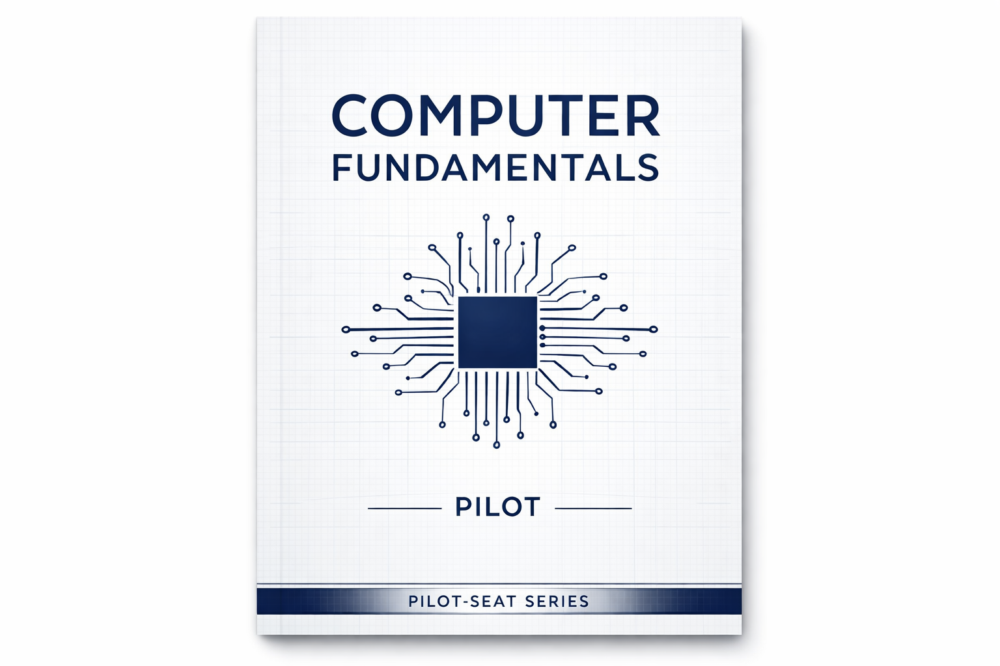

> **Mode:** Book
> **Pilot-Seat Standard**


# Introduction

Computer Fundamentals is the study of the basic concepts, components, and operations of a computer system.

Before learning web development, cloud computing, AI, databases, or system design, it is important to understand how computers work internally.

Every software application ultimately runs on a computer. Understanding computer fundamentals helps developers write better software, troubleshoot issues efficiently, and design scalable systems.


# Why It Exists

Computers were created to solve problems that require:

* Fast calculations
* Data storage
* Information processing
* Automation
* Communication

Without computers, many modern systems would be slow, expensive, or impossible to operate.

Examples:

* Banking systems
* E-commerce platforms
* Social media
* AI applications
* Cloud infrastructure


# Problem It Solves

Humans can process information, but computers can:

* Perform billions of calculations per second
* Store massive amounts of data
* Execute repetitive tasks without fatigue
* Process information consistently

### Example

Without computers:

```text
Student Records
↓
Paper Files
↓
Manual Search
↓
Slow Process
```

With computers:

```text
Student Records
↓
Database
↓
Instant Search
↓
Fast Results
```


# What is a Computer?

A computer is an electronic device that accepts input, processes data, stores information, and produces output.

### Basic Flow

```text
Input
  ↓
Processing
  ↓
Storage
  ↓
Output
```

### Real Example

```text
Keyboard
  ↓
CPU
  ↓
Memory
  ↓
Monitor
```


# Characteristics of a Computer

## 1. Speed

Computers process millions or billions of operations per second.

### Example

```text
Human:
Several minutes

Computer:
Milliseconds
```


## 2. Accuracy

Computers perform calculations accurately when given correct instructions.


## 3. Storage

Computers can store large amounts of information.

Examples:

* Documents
* Images
* Videos
* Databases


## 4. Automation

Once programmed, computers can execute tasks automatically.

Example:

```text
Schedule Backup
↓
Runs Every Night
↓
No Human Intervention
```


## 5. Versatility

Computers are used in:

* Education
* Banking
* Healthcare
* AI
* Gaming
* Cloud Computing


# Components of a Computer System

A computer system consists of:

```text
Computer System
│
├── Hardware
├── Software
├── Data
├── Users
└── Procedures
```


# Hardware

Hardware refers to the physical components of a computer.

Examples:

* CPU
* RAM
* Hard Disk
* Monitor
* Keyboard
* Mouse


## Hardware Architecture

<div align = center>

```text
+----------------+
| Input Devices  |
+----------------+
        ↓
+----------------+
|      CPU       |
+----------------+
        ↓
+----------------+
| Memory/Storage |
+----------------+
        ↓
+----------------+
| Output Devices |
+----------------+
```
</div>


# Software

Software refers to the instructions that tell hardware what to do.

Examples:

* Windows
* Linux
* Browser
* VS Code
* Database Software


## Types of Software

### System Software

Controls computer operations.

Examples:

* Operating System
* Device Drivers


### Application Software

Used by end users.

Examples:

* Chrome
* Microsoft Word
* Photoshop


# Input Devices

Input devices send data to the computer.

Examples:

<div align = center>

| Device     | Purpose     |
| ---------- | ----------- |
| Keyboard   | Text Input  |
| Mouse      | Navigation  |
| Scanner    | Image Input |
| Microphone | Audio Input |
| Webcam     | Video Input |

</div>

# Output Devices

Output devices present processed information.

Examples:

<div align = center>

| Device    | Purpose        |
| --------- | -------------- |
| Monitor   | Visual Output  |
| Printer   | Printed Output |
| Speakers  | Audio Output   |
| Projector | Display Output |

</div>


# Central Processing Unit (CPU)

The CPU is often called the brain of the computer.

It executes instructions and controls all operations.


## CPU Architecture

```text
CPU
│
├── Control Unit (CU)
├── Arithmetic Logic Unit (ALU)
└── Registers
```


## Control Unit (CU)

Responsible for:

* Managing instructions
* Coordinating operations
* Controlling data flow


## Arithmetic Logic Unit (ALU)

Responsible for:

* Addition
* Subtraction
* Multiplication
* Division
* Logical operations


## Registers

Small, extremely fast storage locations inside the CPU.

Used to store temporary data during processing.


# Memory

Memory stores data and instructions.


## Memory Hierarchy

```mermaid
Registers
    ↓
Cache
    ↓
RAM
    ↓
SSD/HDD
```

Higher levels:

* Faster
* More expensive
* Smaller

Lower levels:

* Slower
* Cheaper
* Larger


# Primary Memory

Primary memory is directly accessible by the CPU.


## RAM (Random Access Memory)

Temporary storage.

Characteristics:

* Fast
* Volatile
* Stores running programs

Example:

```text
Open Browser
↓
Loaded into RAM
↓
Browser Runs
```


## ROM (Read Only Memory)

Permanent storage.

Stores startup instructions.

Example:

```text
Power On
↓
BIOS Executes
↓
Operating System Loads
```


# Secondary Storage

Used for long-term storage.

Examples:

* SSD
* HDD
* USB Drive


## Storage Comparison

<div align = center>

| Feature   | RAM       | SSD  |
| --------- | --------- | ---- |
| Speed     | Very Fast | Fast |
| Volatile  | Yes       | No   |
| Temporary | Yes       | No   |
| Permanent | No        | Yes  |

</div>

# Operating System

An Operating System (OS) manages hardware and software resources.

Examples:

* Windows
* Linux
* macOS


## Responsibilities of an OS

```text
Process Management
Memory Management
File Management
Device Management
Security
```


# How a Program Runs

When a user opens an application:

```text
User Clicks App
        ↓
Operating System
        ↓
Loads Program into RAM
        ↓
CPU Executes Instructions
        ↓
Output Displayed
```


# Number Systems

Computers understand only binary values.

```text
0
1
```


## Common Number Systems

<div align = center>

| System      | Base |
| ----------- | ---- |
| Binary      | 2    |
| Octal       | 8    |
| Decimal     | 10   |
| Hexadecimal | 16   |

</div>

# Binary Basics

Example:

```text
Decimal: 5

Binary: 101
```

Because:

```text
1×4 + 0×2 + 1×1 = 5
```


# Data Representation

Everything inside a computer becomes binary.

Examples:

```text
Text
Images
Audio
Videos
Programs
```

All stored as:

```text
0s and 1s
```

<div align = center>

# Computer Generations

| Generation | Technology                |
| ---------- | ------------------------- |
| First      | Vacuum Tubes              |
| Second     | Transistors               |
| Third      | Integrated Circuits       |
| Fourth     | Microprocessors           |
| Fifth      | AI and Advanced Computing |

</div>


# Real-World Example

When you open a website:

```text
User Opens Browser
        ↓
Browser Sends Request
        ↓
CPU Processes Request
        ↓
RAM Stores Active Data
        ↓
Operating System Manages Resources
        ↓
Response Displayed
```

This simple action involves nearly every fundamental concept discussed above.


# Best Practices

## Understand Before Memorizing

### Problem

Developers memorize commands without understanding systems.

### Solution

Learn how hardware, operating systems, memory, and software interact.

### Benefit

Better debugging and architectural decisions.


## Learn Resource Usage

### Problem

Applications consume excessive CPU and memory.

### Solution

Understand how memory and processing work.

### Benefit

Efficient applications.


## Build Fundamentals First

### Problem

Learning advanced frameworks without foundations.

### Solution

Master computer fundamentals before advanced technologies.

### Benefit

Faster learning and deeper understanding.


# Common Mistakes

### Mistake 1

Thinking RAM and Storage are the same.


### Mistake 2

Ignoring Operating System concepts.


### Mistake 3

Learning frameworks without understanding computing basics.


### Mistake 4

Not understanding how programs execute.


# Related Topics

```text
Operating Systems
Computer Networks
Programming Languages
Databases
System Design
Cloud Computing
Cyber Security
Web Development
```


# Summary

## What We Learned

* What a computer is
* Hardware and software
* CPU architecture
* Memory hierarchy
* RAM and storage
* Operating systems
* Binary representation
* Program execution


## Why It Matters

Every application, database, cloud service, and AI model ultimately runs on computer systems.

Strong computer fundamentals make advanced topics easier to understand.


## Key Takeaways

* CPU executes instructions.
* RAM stores active data.
* Storage keeps data permanently.
* Operating systems manage resources.
* Everything inside a computer is represented in binary.
* Understanding fundamentals improves software engineering skills.


# Keywords

```text
Computer
Hardware
Software
CPU
ALU
Control Unit
Registers
Memory
RAM
ROM
SSD
HDD
Operating System
Binary
Storage
Input Device
Output Device
Processing
Data Representation
```


# Glossary
<div align=center>

| Term     | Meaning                           |
| -------- | --------------------------------- |
| CPU      | Central Processing Unit           |
| RAM      | Random Access Memory              |
| ROM      | Read Only Memory                  |
| ALU      | Arithmetic Logic Unit             |
| OS       | Operating System                  |
| SSD      | Solid State Drive                 |
| HDD      | Hard Disk Drive                   |
| Binary   | Base-2 Number System              |
| Hardware | Physical Components               |
| Software | Instructions Executed by Hardware |

</div>


## Next Recommended Chapters

```text
01. Computer Fundamentals
    ├── Introduction to Computers ✅
    ├── Hardware Components
    ├── Operating Systems
    ├── Memory Management
    ├── Computer Networking
    ├── Processes & Threads
    ├── File Systems
    ├── System Calls
    └── Virtualization

02. Web Development
```

This chapter serves as the foundation for everything that follows in Pilot-Seat.
