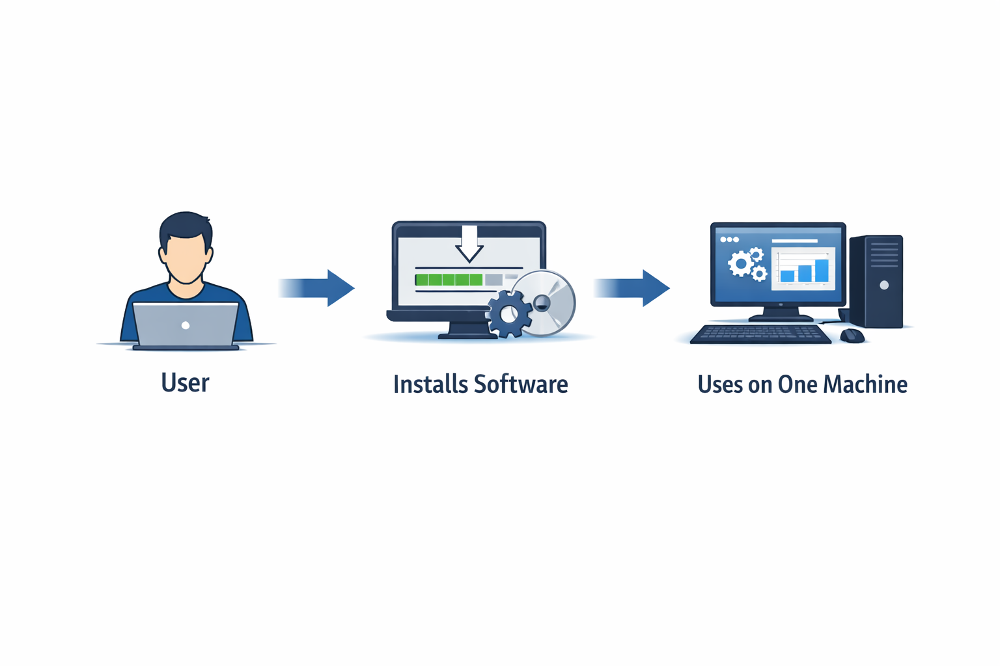
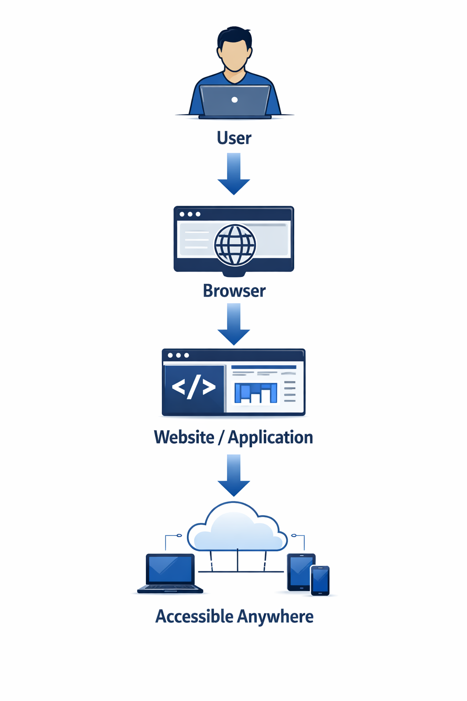
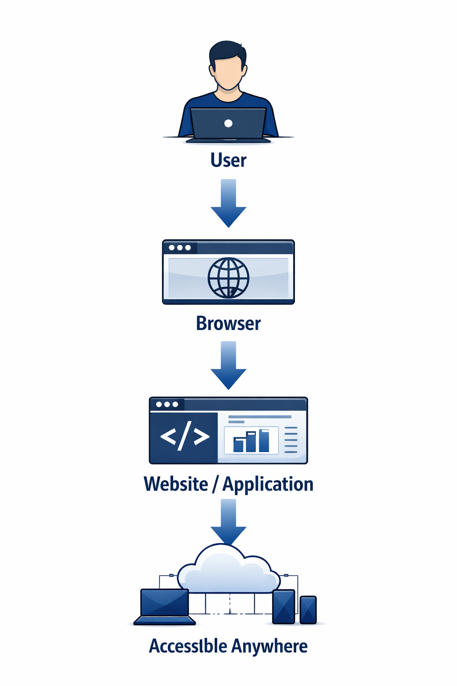
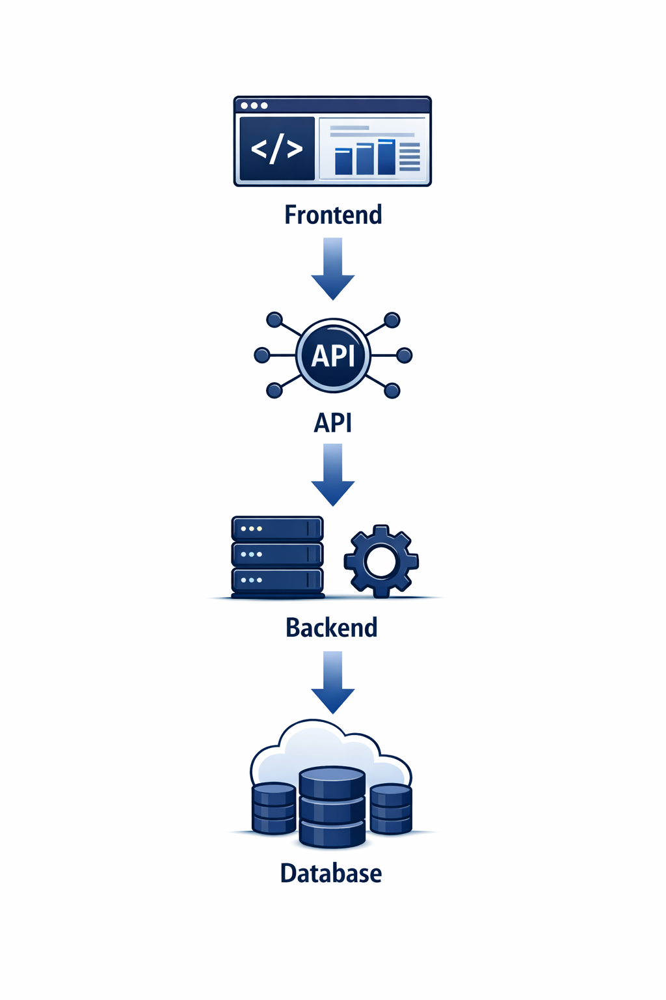
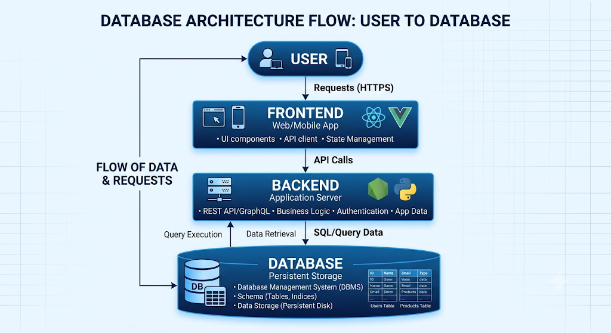
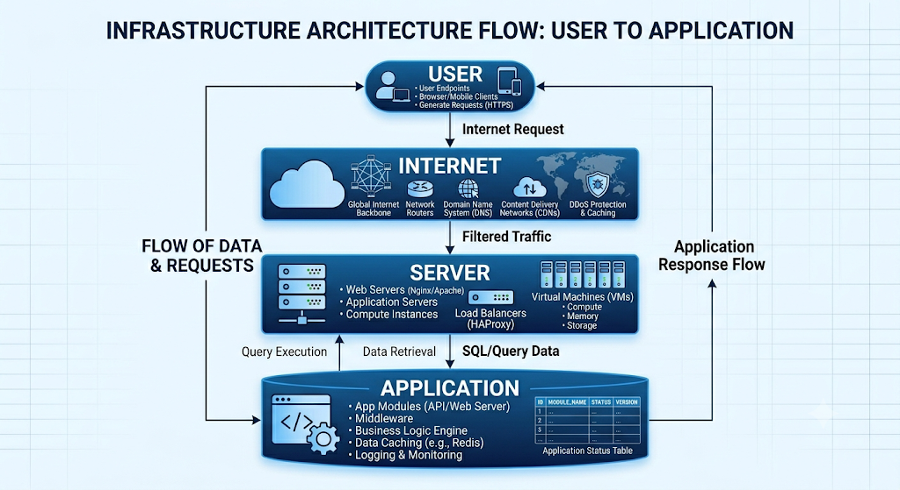
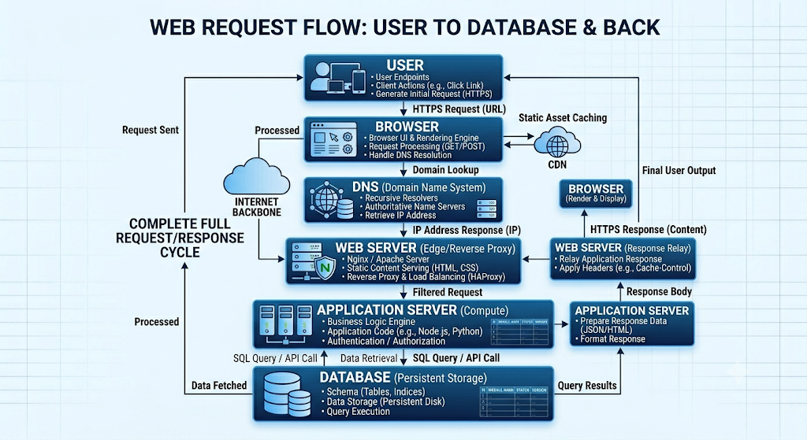

> **Mode:** Book
> **Pilot-Seat Standard**


# Introduction

Web Development is the process of creating, maintaining, and improving websites and web applications that run in a web browser.

A web application can be:

* Personal portfolio
* Blog platform
* E-commerce store
* Social media platform
* Banking application
* SaaS product
* AI-powered application

When users access a website through a browser, multiple technologies work together to deliver content, process requests, store data, and provide functionality.


# Why It Exists

Before web development, software was primarily installed directly on individual computers.

This created several challenges:

* Software distribution was difficult
* Updates required manual installation
* Cross-device access was limited
* Collaboration was harder

The web solved these problems by allowing applications to run through a browser.

### Example

Without Web Development:

<div align = center>


</div>

With Web Development:

<div align = center>



</div>

# Problem It Solves

Web development enables:

* Global accessibility
* Centralized updates
* Multi-device compatibility
* Real-time communication
* Online collaboration
* Scalable software distribution

<div align = center>


### Real World Examples

| Platform | Purpose                 |
| -------- | ----------------------- |
| Google   | Search Engine           |
| Amazon   | Online Shopping         |
| Netflix  | Video Streaming         |
| LinkedIn | Professional Networking |
| GitHub   | Software Collaboration  |

</div>

# What is a Website?

A website is a collection of interconnected web pages accessible through the internet.

Examples:

```text
Portfolio Website
Company Website
Blog Website
News Website
Educational Website
```


# What is a Web Application?

A web application is an interactive software system that runs inside a browser.

Examples:

```text
Gmail
YouTube
GitHub
Notion
ChatGPT
```

Difference:

<div align = center>


| Website                        | Web Application         |
| ------------------------------ | ----------------------- |
| Primarily Displays Information | Allows User Interaction |
| Static or Dynamic              | Highly Dynamic          |
| Simple Content                 | Complex Business Logic  |

</div>

# Evolution of Web Development

## Web 1.0

```text
Read Only Web
```

Characteristics:

* Static pages
* Limited interaction
* Simple HTML

Example:

```text
Personal Websites
Company Brochures
```


## Web 2.0

```text
Read + Write Web
```

Characteristics:

* User-generated content
* Social media
* Interactive applications

Examples:

* Facebook
* YouTube
* Twitter


## Web 3.0

```text
Decentralized Web
```

Characteristics:

* Blockchain integration
* Smart contracts
* Digital ownership

Examples:

* Crypto Wallets
* Decentralized Applications


# Core Components of Web Development

```text
Web Development
│
├── Frontend
├── Backend
├── Database
└── Infrastructure
```


# Frontend Development

Frontend is the user-facing part of a web application.

Everything users see and interact with belongs to the frontend.

Examples:

```text
Buttons
Forms
Navigation
Images
Tables
Dashboards
```


## Frontend Architecture



## Frontend Technologies

### HTML

Responsible for structure.

Example:

```html
<h1>Hello World</h1>
```


### CSS

Responsible for styling.

Example:

```css
h1 {
  color: blue;
}
```


### JavaScript

Responsible for behavior and interactivity.

Example:

```javascript
button.onclick = () => {
  alert("Clicked");
};
```

# Backend Development

Backend handles business logic, data processing, and communication with databases.

Users do not directly see backend operations.


## Backend Responsibilities

```text
Authentication
Authorization
Data Processing
API Handling
Business Logic
Database Communication
```

## Backend Architecture



## Backend Technologies

Examples:

* Node.js
* Go
* Java
* Python
* ASP.NET


# Databases

Databases store application data.

Examples:

```text
Users
Orders
Products
Transactions
Messages
```

## Database Flow


## Types of Databases

### Relational Databases

Examples:

* PostgreSQL
* MySQL

Structure:

```text
Rows
Columns
Relationships
```


### NoSQL Databases

Examples:

* MongoDB

Structure:

```text
Documents
Collections
Flexible Schema
```

# Infrastructure Layer

Infrastructure hosts and delivers applications.

Examples:

```text
Servers
Cloud Platforms
CDNs
Load Balancers
```


## Infrastructure Architecture




# How the Web Works

This is the most important concept in web development.


## Step 1: User Opens Browser

```text
Chrome
Edge
Firefox
Safari
```


## Step 2: User Enters URL

Example:

```text
https://example.com
```

## Step 3: Browser Finds Server

Using:

```text
DNS
```

DNS translates:

```text
example.com
```

Into:

```text
IP Address
```

## Step 4: Request Sent

```text
Browser
 ↓
HTTP Request
 ↓
Server
```

## Step 5: Server Processes Request

Server:

```text
Validates Request
Executes Logic
Queries Database
```

## Step 6: Response Returned

```text
Server
 ↓
HTTP Response
 ↓
Browser
```


## Step 7: Browser Renders Page

User sees:

```text
HTML
CSS
JavaScript
```

# Complete Web Request Flow



# Modern Web Application Architecture

## Basic Architecture

```text
Browser
 ↓
Backend
 ↓
Database
```


## Production Architecture

```text
User
 ↓
CDN
 ↓
Load Balancer
 ↓
Application Servers
 ↓
Cache
 ↓
Database
```


## Enterprise Architecture

```text
Users
 ↓
CDN
 ↓
API Gateway
 ↓
Microservices
 ↓
Message Queue
 ↓
Databases
```

# Web Development Workflow

## Planning

```text
Requirements
 ↓
User Stories
 ↓
Features
```


## Design

```text
Wireframes
 ↓
UI Design
 ↓
Architecture Design
```

## Development

```text
Frontend
Backend
Database
```

## Testing

```text
Unit Testing
Integration Testing
Manual Testing
```

## Deployment

```text
GitHub
 ↓
CI/CD
 ↓
Cloud
 ↓
Production
```

# Best Practices

## Design Before Coding

### Problem

Developers jump into coding without planning.

### Solution

Create requirements, workflows, and architecture first.

### Benefits

* Cleaner code
* Better scalability
* Easier maintenance

### Rollback

Refactor architecture before adding new features.


## Separate Concerns

### Problem

Frontend, backend, and database logic become mixed.

### Solution

Use layered architecture.

```text
Frontend
 ↓
API
 ↓
Service Layer
 ↓
Database
```

### Benefits

* Better maintainability
* Easier testing

### Rollback

Gradually separate modules into layers.


## Validate User Input

### Problem

Invalid or malicious input can break systems.

### Solution

Validate all incoming data.

### Benefits

* Security
* Stability
* Data integrity

### Rollback

Apply validation middleware at API boundaries.


# Industry Standards

Modern applications commonly use:

```text
Frontend:
HTML
CSS
JavaScript
TypeScript
React
Next.js

Backend:
Node.js
Go
Java

Databases:
PostgreSQL
MongoDB

Cloud:
AWS
Azure
GCP

Containers:
Docker
Kubernetes
```

# Common Mistakes

## Mistake 1

Learning frameworks before understanding the web.


## Mistake 2

Ignoring HTTP fundamentals.


## Mistake 3

Not understanding browser behavior.


## Mistake 4

Mixing frontend and backend responsibilities.


## Mistake 5

Building without architecture planning.


# Security Considerations

Important concepts:

```text
Authentication
Authorization
Input Validation
HTTPS
Session Security
Rate Limiting
Password Hashing
```


# Performance Considerations

Important areas:

```text
Caching
Database Optimization
CDN Usage
Image Optimization
Code Splitting
Compression
```


# Related Technologies

```text
HTML
CSS
JavaScript
TypeScript
React
Next.js
Node.js
Express.js
Go
REST APIs
GraphQL
PostgreSQL
MongoDB
Redis
Docker
Kubernetes
AWS
```


# Suggested Projects

### Beginner

```text
Portfolio Website
Personal Blog
Landing Page
```

### Intermediate

```text
Task Manager
Expense Tracker
Notes Application
```

### Advanced

```text
E-Commerce Platform
Learning Management System
Job Portal
SaaS Product
```


# Summary

## What We Learned

* What web development is
* Difference between websites and web applications
* Frontend, backend, database, and infrastructure layers
* How web requests work
* Modern web architectures
* Development workflow
* Best practices


## Why It Matters

Almost every modern software product is delivered through the web.

Understanding web development provides the foundation for:

* Full Stack Development
* Backend Engineering
* Cloud Engineering
* DevOps
* AI-Powered Applications
* SaaS Product Development


## Key Takeaways

* Web development is more than coding pages.
* Modern applications consist of multiple layers.
* HTTP request-response is the foundation of the web.
* Architecture matters as applications grow.
* Understanding fundamentals makes frameworks easier to learn.

<div align = center>

# Keywords

```text
Web Development
Website
Web Application
Frontend
Backend
Database
Infrastructure
Browser
DNS
HTTP
HTTPS
API
Server
Client
Deployment
Cloud
CDN
Load Balancer
Microservices
```
</div>

<div align =center>

# Glossary

| Term          | Meaning                               |
| ------------- | ------------------------------------- |
| Browser       | Software used to access web pages     |
| Client        | Device or application requesting data |
| Server        | System providing data or services     |
| Frontend      | User-facing layer                     |
| Backend       | Business logic layer                  |
| Database      | Data storage system                   |
| DNS           | Domain Name System                    |
| HTTP          | HyperText Transfer Protocol           |
| API           | Application Programming Interface     |
| CDN           | Content Delivery Network              |
| Load Balancer | Distributes traffic across servers    |

</div>

# Next Chapters

```text
02-Web-Development/
│
├── 01-Internet Fundamentals
├── 02-How The Web Works
├── 03-HTTP & HTTPS
├── 04-DNS
├── 05-Browsers
├── 06-Web Servers
├── 07-Frontend Development
├── 08-Backend Development
├── 09-REST APIs
├── 10-Authentication
├── 11-Web Security
└── 12-Web Architecture
```

These chapters will progressively build a complete understanding of modern web systems from browser request to production deployment.
