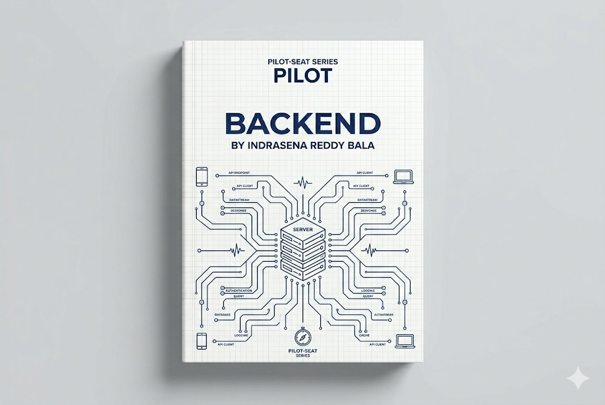

> **Mode:** Book
> **Pilot-Seat Standard**


# Introduction

Backend Development is the practice of building the server-side part of an application.

The backend is responsible for:

* Processing requests
* Executing business logic
* Managing authentication
* Communicating with databases
* Integrating external services
* Returning responses to users

Users interact with the frontend, but most critical operations happen in the backend.

### Example

When a user logs into an application:

```text
User
 ↓
Frontend
 ↓
Backend
 ↓
Database
 ↓
Response
```

The frontend collects credentials, but the backend verifies them.

---

# Why It Exists

Frontend applications cannot securely:

* Access databases directly
* Store secrets
* Process sensitive business logic
* Handle authorization
* Manage system integrations

Backend development exists to act as a secure and controlled layer between users and system resources.

---

# Problem It Solves

Without a backend:

```text
User
 ↓
Database
```

Problems:

* Security risks
* No validation
* No business rules
* No scalability
* No access control

With a backend:

```text
User
 ↓
Frontend
 ↓
Backend
 ↓
Database
```

The backend becomes the system's decision-making layer.

---

# What is a Backend?

A backend is a collection of services running on servers that process requests and provide data to clients.

It typically consists of:

```text
Backend
│
├── APIs
├── Business Logic
├── Authentication
├── Authorization
├── Database Layer
├── Caching
├── External Integrations
└── Background Jobs
```

---

# Where Backend Fits in Web Development

## Complete Architecture

```text
User
 ↓
Browser
 ↓
Frontend
 ↓
Backend
 ↓
Database
```

Responsibilities:

| Layer    | Responsibility |
| -------- | -------------- |
| Frontend | User Interface |
| Backend  | Business Logic |
| Database | Data Storage   |

---

# Core Concepts

To understand backend development, you must understand these building blocks:

```text
Backend
│
├── Server
├── API
├── Request
├── Response
├── Database
├── Authentication
├── Authorization
├── Caching
├── Queue
└── Background Jobs
```

---

# Server

A server is a computer or process that listens for requests and sends responses.

Example:

```text
Client
 ↓
Request
 ↓
Server
 ↓
Response
```

A server may handle:

* User logins
* Product searches
* Payments
* Notifications

---

# Request and Response

Backend communication follows the request-response model.

### Request

Sent by client:

```http
GET /users
```

### Response

Returned by server:

```json
{
  "users": []
}
```

---

## Request Flow

```text
Client
 ↓
Request
 ↓
Backend
 ↓
Process Logic
 ↓
Response
 ↓
Client
```

---

# APIs

## What is an API?

API (Application Programming Interface) allows systems to communicate.

Frontend applications use APIs to interact with backend services.

Example:

```text
Frontend
 ↓
API
 ↓
Backend
```

---

## Common API Operations

```http
GET    /users
POST   /users
PUT    /users/1
DELETE /users/1
```

---

# Business Logic

Business logic contains the rules that define application behavior.

Examples:

### E-commerce

```text
Cannot purchase
if stock = 0
```

### Banking

```text
Cannot transfer
more than account balance
```

### Job Portal

```text
Only recruiters
can post jobs
```

Business logic belongs in the backend, not the frontend.

---

# Database Layer

Applications need persistent storage.

Backend communicates with databases.

---

## Database Flow

```text
Frontend
 ↓
Backend
 ↓
Database
```

Examples of stored data:

```text
Users
Products
Orders
Payments
Messages
```

---

# Types of Databases

## Relational Databases

Examples:

* PostgreSQL
* MySQL

Characteristics:

```text
Tables
Rows
Columns
Relationships
```

---

## NoSQL Databases

Example:

* MongoDB

Characteristics:

```text
Documents
Collections
Flexible Structure
```

---

# Authentication

Authentication answers:

```text
Who are you?
```

Examples:

* Username + Password
* OTP
* OAuth
* Social Login

---

## Authentication Workflow

```text
User Login
 ↓
Backend Validation
 ↓
Token Created
 ↓
Access Granted
```

---

# Authorization

Authorization answers:

```text
What can you do?
```

Example:

```text
Admin
 ↓
Can Delete Users

User
 ↓
Cannot Delete Users
```

---

# Authentication vs Authorization

| Authentication | Authorization    |
| -------------- | ---------------- |
| Who are you?   | What can you do? |
| Login          | Permissions      |
| Identity       | Access Control   |

---

# Backend Architecture

## Basic Architecture

```text
Frontend
 ↓
Backend
 ↓
Database
```

Suitable for:

* Small applications
* MVPs
* Learning projects

---

## Layered Architecture

Professional applications use layers.

```text
Controller
 ↓
Service
 ↓
Repository
 ↓
Database
```

---

## Layer Responsibilities

### Controller

Handles:

```text
Request
Response
Validation
```

---

### Service

Handles:

```text
Business Logic
```

---

### Repository

Handles:

```text
Database Operations
```

---

### Database

Handles:

```text
Storage
```

---

# Example Login Flow

```text
User
 ↓
POST /login
 ↓
Controller
 ↓
Service
 ↓
Repository
 ↓
Database
 ↓
Token
 ↓
Response
```

---

# Modern Backend Components

## Cache

Used to reduce database load.

Example:

Redis

---

### Cache Flow

```text
Request
 ↓
Cache
 ↓
Database
```

If data exists in cache:

```text
Fast Response
```

Otherwise:

```text
Database Query
 ↓
Cache Update
```

---

# Message Queues

Used for asynchronous processing.

Examples:

* RabbitMQ
* Apache Kafka

---

### Queue Workflow

```text
Order Created
 ↓
Queue
 ↓
Email Service
 ↓
Notification Sent
```

---

# Background Jobs

Some tasks should not block users.

Examples:

```text
Sending Emails
Generating Reports
Processing Images
```

---

### Background Job Flow

```text
User Action
 ↓
Queue Job
 ↓
Background Worker
 ↓
Task Completed
```

---

# Backend Technologies

Common choices:

### JavaScript

* Node.js

---

### Go

* Go

---

### Java

* Java
* Spring Boot

---

### Python

* Python
* Django

---

# Backend Folder Structure

Example:

```text
src/
│
├── controllers/
├── services/
├── repositories/
├── middleware/
├── routes/
├── models/
├── config/
├── validations/
├── utils/
└── tests/
```

---

# Production Backend Architecture

```text
Users
 ↓
Load Balancer
 ↓
API Servers
 ↓
Cache
 ↓
Database
```

---

# Enterprise Backend Architecture

```text
Users
 ↓
API Gateway
 ↓
Microservices
 ↓
Message Queue
 ↓
Databases
```

---

# Backend Development Workflow

## Step 1

Gather requirements.

Example:

```text
User Registration
Login
Profile Management
```

---

## Step 2

Design database.

Example:

```text
Users
Profiles
Roles
```

---

## Step 3

Design APIs.

Example:

```http
POST /register
POST /login
GET  /profile
```

---

## Step 4

Implement business logic.

---

## Step 5

Add security.

---

## Step 6

Deploy to production.

---

# Best Practices

## Use Layered Architecture

### Problem

Business logic becomes mixed with database code.

### Solution

Separate:

```text
Controller
Service
Repository
```

### Benefits

* Easier maintenance
* Better testing
* Cleaner code

### Rollback

Refactor logic into dedicated layers.

---

## Validate All Input

### Problem

Invalid data enters the system.

### Solution

Validate requests before processing.

### Benefits

* Security
* Data integrity

### Rollback

Add validation middleware.

---

## Use Logging

### Problem

Production issues become difficult to diagnose.

### Solution

Log important events.

Examples:

```text
Errors
Warnings
Authentication Events
API Requests
```

### Benefits

Faster troubleshooting.

---

# Industry Standards

Modern backend systems commonly use:

```text
Node.js
Go
Java
Python

REST APIs
GraphQL

PostgreSQL
MongoDB

Redis

Docker
Kubernetes

AWS
Azure
GCP
```

---

# Common Mistakes

## Mistake 1

Putting business logic in controllers.

---

## Mistake 2

Skipping input validation.

---

## Mistake 3

Direct database access from frontend.

---

## Mistake 4

Not implementing authorization.

---

## Mistake 5

Ignoring logging and monitoring.

---

# Security Considerations

Critical backend security areas:

```text
Authentication
Authorization
Input Validation
Password Hashing
Rate Limiting
HTTPS
Token Security
SQL Injection Prevention
```

---

# Performance Considerations

Important optimization areas:

```text
Caching
Connection Pooling
Database Indexing
Query Optimization
Load Balancing
Asynchronous Processing
```

---

# Related Technologies

```text
HTTP
REST APIs
GraphQL
PostgreSQL
MongoDB
Redis
Docker
Kubernetes
AWS
System Design
Authentication
Microservices
```

---

# Suggested Projects

## Beginner

```text
User Management API
Notes API
Task Manager API
```

---

## Intermediate

```text
Job Portal Backend
Expense Tracker Backend
Blog Platform Backend
```

---

## Advanced

```text
E-Commerce Backend
SaaS Platform
Learning Management System
Ride Sharing Backend
```

---

# Summary

## What We Learned

* Purpose of backend development
* Servers and APIs
* Request-response cycle
* Business logic
* Databases
* Authentication and authorization
* Caching
* Queues
* Backend architectures

---

## Why It Matters

The backend is the engine of modern applications.

It handles:

* Security
* Business rules
* Data processing
* Scalability

Without a strong backend, even the best frontend cannot function properly.

---

## Key Takeaways

* Backend manages business logic.
* APIs connect frontend and backend.
* Databases store application data.
* Authentication verifies identity.
* Authorization controls access.
* Caching improves performance.
* Layered architecture improves maintainability.
* Security must be built into every backend system.

---

# Keywords

```text
Backend
Server
API
Request
Response
Controller
Service
Repository
Business Logic
Database
Authentication
Authorization
JWT
Redis
Caching
Message Queue
Kafka
RabbitMQ
Load Balancer
Microservices
```

---

# Glossary

| Term           | Meaning                                     |
| -------------- | ------------------------------------------- |
| Backend        | Server-side part of an application          |
| API            | Interface for communication between systems |
| Controller     | Handles requests and responses              |
| Service        | Contains business logic                     |
| Repository     | Handles database operations                 |
| Authentication | Verifying user identity                     |
| Authorization  | Determining user permissions                |
| Cache          | Temporary fast storage                      |
| Queue          | System for asynchronous processing          |
| Load Balancer  | Distributes traffic across servers          |


# Next Chapters

```text
04-Backend/
│
├── 01-Internet & HTTP
├── 02-Web Servers
├── 03-REST APIs
├── 04-Authentication
├── 05-Authorization
├── 06-Databases
├── 07-ORM & Query Builders
├── 08-Caching with Redis
├── 09-Message Queues
├── 10-Background Jobs
├── 11-Backend Architecture
├── 12-Microservices
├── 13-Observability
├── 14-Backend Security
└── 15-Scalability Patterns
```

This chapter provides the foundation for understanding how modern backend systems process requests, enforce business rules, manage data, and scale from simple applications to enterprise-grade platforms.
