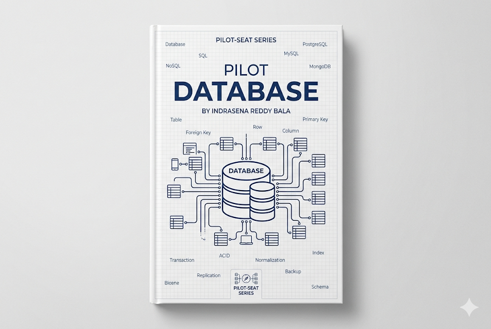

> **Mode:** Book
> **Pilot-Seat Standard**

---

# Introduction

A Database is an organized system used to store, manage, retrieve, and update data efficiently.

Almost every modern application depends on a database.

Examples:

* User accounts
* Product catalogs
* Orders
* Payments
* Messages
* Analytics
* AI application data

Without databases, applications would have no reliable way to persist information.

---

# Why It Exists

Imagine an e-commerce platform.

Without a database:

```text
Products
Orders
Users
Payments
```

would need to be stored in files or memory.

Problems:

* Data loss after restart
* Difficult searching
* Poor scalability
* No relationships between data
* Concurrent access issues

Databases solve these problems by providing structured and reliable data management.

---

# Problem It Solves

Databases help applications:

* Store data permanently
* Retrieve information quickly
* Maintain consistency
* Handle concurrent users
* Support business operations

### Example

Without Database:

```text
Customer Orders
↓
Excel Files
↓
Manual Search
↓
Slow Operations
```

With Database:

```text
Customer Orders
↓
Database
↓
SQL Query
↓
Instant Results
```

---

# What is Data?

Data is information stored and processed by applications.

Examples:

```text
Name
Email
Phone Number
Orders
Products
Transactions
Messages
```

Example User Data:

```json
{
  "id": 1,
  "name": "John",
  "email": "john@example.com"
}
```

---

# Where Database Fits in an Application

## Complete Architecture

```text
User
 ↓
Frontend
 ↓
Backend
 ↓
Database
```

Responsibilities:

| Layer    | Responsibility |
| -------- | -------------- |
| Frontend | User Interface |
| Backend  | Business Logic |
| Database | Data Storage   |

---

# Core Concepts

Every database system revolves around these concepts:

```text
Database
│
├── Tables
├── Records
├── Columns
├── Relationships
├── Queries
├── Indexes
├── Transactions
└── Constraints
```

---

# Database Architecture

## Basic Architecture

```text
Application
      ↓
Database Server
      ↓
Storage
```

---

## Production Architecture

```text
Application
      ↓
Primary Database
      ↓
Replica Databases
      ↓
Storage
```

---

# Tables

A table stores related information.

Example:

## Users Table

| id | name  | email                                         |
| -- | ----- | --------------------------------------------- |
| 1  | John  | [john@example.com](mailto:john@example.com)   |
| 2  | Sarah | [sarah@example.com](mailto:sarah@example.com) |

A table is similar to a spreadsheet but designed for large-scale operations.

---

# Rows (Records)

Each row represents a single record.

Example:

```text
User 1
```

```json
{
  "id": 1,
  "name": "John",
  "email": "john@example.com"
}
```

---

# Columns (Fields)

Columns define the structure of stored data.

Example:

| Column | Purpose           |
| ------ | ----------------- |
| id     | Unique Identifier |
| name   | User Name         |
| email  | Email Address     |

---

# Primary Key

A Primary Key uniquely identifies a record.

Example:

```text
User ID
```

```sql
id = 1
id = 2
id = 3
```

No duplicates allowed.

---

# Relationships

Relationships connect tables.

Example:

```text
Users
 ↓
Orders
```

A user can have multiple orders.

---

## One-to-One

```text
User
 ↓
Profile
```

One user has one profile.

---

## One-to-Many

```text
User
 ↓
Orders
```

One user has many orders.

---

## Many-to-Many

```text
Students
 ↔
Courses
```

Many students can enroll in many courses.

---

# Database Query

A query retrieves or modifies data.

Example:

```sql
SELECT * FROM users;
```

Result:

```text
All Users Returned
```

---

# CRUD Operations

Every database application performs CRUD.

| Operation | Meaning       |
| --------- | ------------- |
| Create    | Insert Data   |
| Read      | Retrieve Data |
| Update    | Modify Data   |
| Delete    | Remove Data   |

---

## Create

```sql
INSERT INTO users(name)
VALUES ('John');
```

---

## Read

```sql
SELECT * FROM users;
```

---

## Update

```sql
UPDATE users
SET name='Mike'
WHERE id=1;
```

---

## Delete

```sql
DELETE FROM users
WHERE id=1;
```

---

# Types of Databases

Modern databases are broadly divided into two categories.

---

# Relational Databases (SQL)

Store data in tables.

Examples:

* PostgreSQL
* MySQL
* Microsoft SQL Server

---

## Architecture

```text
Database
│
├── Tables
├── Rows
├── Columns
└── Relationships
```

---

## Advantages

* Strong consistency
* Structured data
* Relationships
* Mature ecosystem

---

## Best Use Cases

```text
Banking
ERP
Accounting
E-Commerce
Healthcare
```

---

# NoSQL Databases

Store flexible data structures.

Example:

* MongoDB

---

## Document Example

```json
{
  "name": "John",
  "skills": ["JavaScript", "Go"]
}
```

---

## Advantages

* Flexible schema
* Easy scaling
* Fast development

---

## Best Use Cases

```text
Social Media
Analytics
IoT
Content Systems
```

---

# SQL vs NoSQL

| Feature        | SQL      | NoSQL           |
| -------------- | -------- | --------------- |
| Structure      | Fixed    | Flexible        |
| Relationships  | Strong   | Limited         |
| Scaling        | Vertical | Horizontal      |
| Consistency    | Strong   | Often Flexible  |
| Query Language | SQL      | Vendor Specific |

---

# Indexing

Indexes improve query performance.

Without Index:

```text
Search Entire Table
```

With Index:

```text
Jump Directly To Data
```

---

## Example

Searching:

```sql
WHERE email='john@example.com'
```

becomes much faster with an index.

---

# Transactions

A transaction is a group of operations executed together.

Example:

Bank Transfer

```text
Deduct Money
 ↓
Add Money
```

Both operations must succeed.

---

## Transaction Workflow

```text
Begin
 ↓
Operation 1
 ↓
Operation 2
 ↓
Commit
```

If something fails:

```text
Rollback
```

---

# ACID Properties

Every relational database follows ACID principles.

---

## Atomicity

All operations succeed or none succeed.

---

## Consistency

Database remains valid.

---

## Isolation

Transactions do not interfere.

---

## Durability

Committed data survives failures.

---

# Normalization

Normalization reduces data duplication.

Bad:

```text
User Name repeated
1000 times
```

Good:

```text
Store Once
Reference Everywhere
```

Benefits:

* Reduced redundancy
* Better consistency

---

# Denormalization

Sometimes duplication improves performance.

Example:

```text
Analytics Systems
Reporting Systems
```

Tradeoff:

```text
Storage ↑
Speed ↑
```

---

# Database Workflow

## User Registration

```text
User Fills Form
 ↓
Frontend
 ↓
Backend API
 ↓
Database Insert
 ↓
Success Response
```

---

# Database Design Process

## Step 1

Identify entities.

Example:

```text
Users
Products
Orders
Payments
```

---

## Step 2

Define relationships.

---

## Step 3

Create schema.

---

## Step 4

Add constraints.

---

## Step 5

Optimize indexes.

---

# Database Architecture Evolution

## Beginner Architecture

```text
Application
 ↓
Database
```

---

## Production Architecture

```text
Application
 ↓
Primary Database
 ↓
Read Replicas
```

---

## Enterprise Architecture

```text
Applications
 ↓
Database Cluster
 ↓
Replication
 ↓
Backup Systems
```

---

# Best Practices

## Design Before Building

### Problem

Poor schema design causes long-term issues.

### Solution

Create ER diagrams before coding.

### Benefits

* Better maintainability
* Better scalability

### Rollback

Refactor schema using migrations.

---

## Use Indexes Carefully

### Problem

Slow queries.

### Solution

Create indexes on frequently searched columns.

### Benefits

Faster retrieval.

### Rollback

Remove unnecessary indexes.

---

## Use Transactions

### Problem

Partial updates create inconsistent data.

### Solution

Wrap critical operations in transactions.

### Benefits

Data integrity.

### Rollback

Transaction rollback restores previous state.

---

# Industry Standards

Most production systems use:

```text
PostgreSQL
MySQL
MongoDB
Redis
```

Enterprise environments often include:

```text
Replication
Backups
Monitoring
High Availability
```

---

# Common Mistakes

## Mistake 1

No primary keys.

---

## Mistake 2

Ignoring relationships.

---

## Mistake 3

Overusing NoSQL.

---

## Mistake 4

Creating too many indexes.

---

## Mistake 5

Ignoring backups.

---

# Security Considerations

Important areas:

```text
Access Control
Encryption
Backups
Audit Logs
SQL Injection Prevention
```

---

# Performance Considerations

Focus on:

```text
Indexes
Query Optimization
Caching
Connection Pooling
Replication
Partitioning
```

---

# Related Technologies

```text
SQL
PostgreSQL
MySQL
MongoDB
Redis
ORM
Query Builders
Backend Development
System Design
Data Warehousing
```

---

# Suggested Projects

## Beginner

```text
Student Management System
Library Management System
Inventory System
```

---

## Intermediate

```text
Blog Platform
Job Portal
Expense Tracker
```

---

## Advanced

```text
E-Commerce Platform
SaaS Product
Learning Management System
Analytics Platform
```

---

# Summary

## What We Learned

* Purpose of databases
* Tables, rows, and columns
* Relationships
* CRUD operations
* SQL and NoSQL
* Transactions
* ACID principles
* Indexing
* Database architectures

---

## Why It Matters

Databases are the foundation of modern applications.

Without databases:

* No user accounts
* No orders
* No payments
* No business data

Every backend system depends on effective data management.

---

## Key Takeaways

* Databases store application data.
* SQL databases use structured tables.
* NoSQL databases use flexible structures.
* Relationships connect data.
* Transactions ensure consistency.
* Indexes improve performance.
* Good schema design prevents future problems.
* Security and backups are essential.

---

# Keywords

```text
Database
SQL
NoSQL
PostgreSQL
MySQL
MongoDB
Table
Row
Column
Primary Key
Foreign Key
CRUD
Transaction
ACID
Index
Normalization
Replication
Backup
Schema
```

---

# Glossary

| Term        | Meaning                                 |
| ----------- | --------------------------------------- |
| Database    | System for storing and managing data    |
| Table       | Collection of related records           |
| Row         | Single record in a table                |
| Column      | Field within a table                    |
| Primary Key | Unique identifier                       |
| Foreign Key | Link between tables                     |
| Query       | Database request                        |
| Transaction | Group of operations executed together   |
| Index       | Data structure for faster lookups       |
| Schema      | Structure of a database                 |
| Replication | Copying data to multiple databases      |
| ACID        | Reliability principles for transactions |

---

# Next Chapters

```text
05-Databases/
│
├── 01-Introduction to Databases
├── 02-Relational Databases
├── 03-SQL Fundamentals
├── 04-Database Design
├── 05-Relationships & Keys
├── 06-Indexing
├── 07-Transactions & ACID
├── 08-Normalization
├── 09-PostgreSQL
├── 10-MySQL
├── 11-MongoDB
├── 12-Redis
├── 13-Database Scaling
├── 14-Database Security
└── 15-Database Administration
```

This chapter establishes the foundation for understanding how data is structured, stored, retrieved, protected, and scaled in modern software systems.
