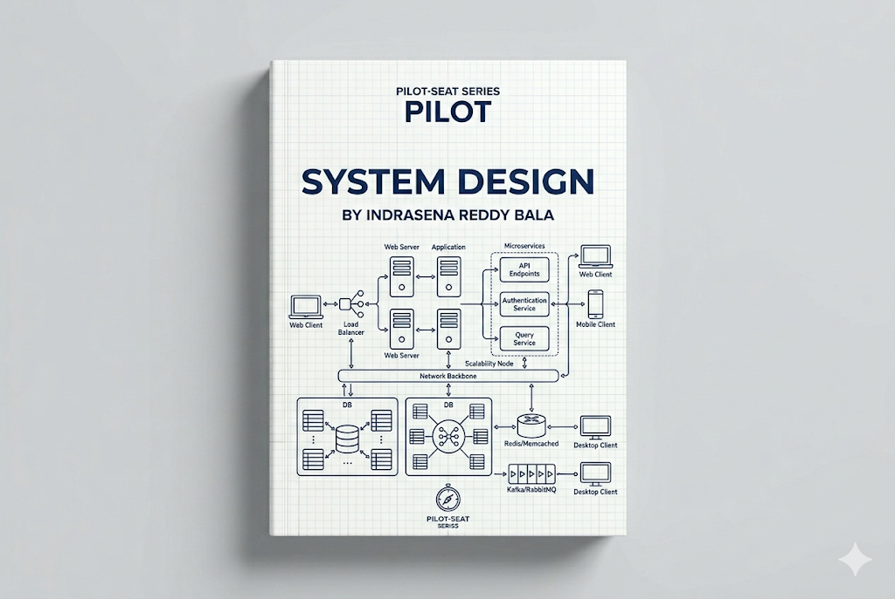

> **Mode:** Book
> **Pilot-Seat Standard**

---

# Introduction

System Design is the process of designing the architecture, components, data flow, and infrastructure of a software system to meet business and technical requirements.

It answers questions such as:

* How should the application be structured?
* How will users interact with the system?
* How will data flow?
* How will the system scale?
* How will failures be handled?
* How will performance and security be maintained?

System Design bridges the gap between writing code and building production-ready software systems.

---

# Why It Exists

A small application can often run on a single server.

As the application grows:

* More users arrive
* More data is generated
* More requests are processed
* More services are added

Without proper design:

```text
Users
 ↓
Application
 ↓
Crash
```

System Design exists to ensure applications remain:

* Reliable
* Scalable
* Secure
* Maintainable
* Performant

---

# Problem It Solves

Imagine building a social media platform.

Requirements:

```text
100 Million Users
Posts
Likes
Comments
Notifications
Messages
```

A simple architecture will eventually fail.

Problems:

```text
Slow Responses
Database Overload
Downtime
Poor User Experience
```

System Design helps architects and engineers create systems that can grow efficiently.

---

# What is a System?

A system is a collection of components working together to achieve a goal.

Example:

```text
E-Commerce System
│
├── Frontend
├── Backend
├── Database
├── Cache
├── Payment Service
└── Notification Service
```

---

# Core Objectives of System Design

A well-designed system should provide:

```text
Scalability
Reliability
Availability
Maintainability
Performance
Security
Cost Efficiency
```

---

# Where System Design Fits

## Software Engineering Lifecycle

```text
Requirements
      ↓
System Design
      ↓
Development
      ↓
Testing
      ↓
Deployment
      ↓
Maintenance
```

System Design happens before large-scale implementation.

---

# Core Concepts

System Design is built upon several fundamental concepts.

```text
System Design
│
├── Architecture
├── Scalability
├── Availability
├── Reliability
├── Performance
├── Security
├── Data Management
├── Distributed Systems
└── Monitoring
```

---

# Architecture

Architecture defines how components interact.

Example:

```text
User
 ↓
Frontend
 ↓
Backend
 ↓
Database
```

Architecture acts as the blueprint of the system.

---

# Scalability

Scalability is the ability of a system to handle increasing workloads.

---

## Vertical Scaling

Increase resources of a single machine.

```text
CPU ↑
RAM ↑
Storage ↑
```

Architecture:

```text
Application
 ↓
Large Server
```

Advantages:

* Simple

Limitations:

* Hardware limits
* Expensive

---

## Horizontal Scaling

Add more servers.

```text
Server 1
Server 2
Server 3
```

Architecture:

```text
Users
 ↓
Load Balancer
 ↓
Multiple Servers
```

Advantages:

* Better scalability
* High availability

---

# Availability

Availability measures how often a system is operational.

Formula:

Availability = \frac{Uptime}{Total\ Time}

Examples:

| Availability | Downtime         |
| ------------ | ---------------- |
| 99%          | ~3.65 Days/Year  |
| 99.9%        | ~8.76 Hours/Year |
| 99.99%       | ~52 Minutes/Year |

---

# Reliability

Reliability measures whether a system consistently performs correctly.

Example:

```text
User Places Order
 ↓
Order Successfully Stored
```

Every time.

---

# Performance

Performance measures:

```text
Response Time
Latency
Throughput
Resource Usage
```

---

## Latency

Time required to complete a request.

```text
Request
 ↓
Processing
 ↓
Response
```

Lower latency = better user experience.

---

## Throughput

Number of requests processed per second.

Example:

```text
5000 Requests/Second
```

---

# Capacity Planning

Capacity planning estimates future requirements.

Questions:

```text
How many users?
How many requests?
How much storage?
How much bandwidth?
```

---

# Load Balancer

A Load Balancer distributes traffic across multiple servers.

Architecture:

```text
Users
 ↓
Load Balancer
 ↓
Server A
Server B
Server C
```

Benefits:

* High availability
* Better performance
* Fault tolerance

---

# Database Design

Databases are often the bottleneck in large systems.

System designers must consider:

```text
Schema Design
Indexes
Replication
Partitioning
Backups
```

---

# Database Replication

Replication creates copies of databases.

Architecture:

```text
Primary Database
        ↓
Replica 1
Replica 2
```

Benefits:

* Read scalability
* Backup redundancy

---

# Database Sharding

Sharding splits data across multiple databases.

Example:

```text
Users A-M
 ↓
Database 1

Users N-Z
 ↓
Database 2
```

Benefits:

* Better scalability

Challenges:

* Increased complexity

---

# Caching

Caching stores frequently used data in fast storage.

Common Tool:

* Redis

---

## Cache Architecture

```text
Application
      ↓
Cache
      ↓
Database
```

Workflow:

```text
Request
 ↓
Cache Check
 ↓
Found? → Return Data
 ↓
Not Found
 ↓
Database Query
 ↓
Cache Update
```

Benefits:

* Reduced database load
* Faster responses

---

# Content Delivery Network (CDN)

A CDN stores content closer to users.

Architecture:

```text
User
 ↓
Nearest CDN
 ↓
Content Served
```

Benefits:

* Faster loading
* Reduced server load

---

# API Design

APIs connect system components.

Example:

```http
GET    /products
POST   /orders
PUT    /users
DELETE /cart
```

Good APIs should be:

* Consistent
* Secure
* Versioned

---

# Microservices

Microservices split systems into independent services.

Architecture:

```text
User
 ↓
API Gateway
 ↓
├── User Service
├── Product Service
├── Payment Service
└── Notification Service
```

Benefits:

* Independent deployment
* Better scalability

Challenges:

* Operational complexity

---

# Monolithic Architecture

All functionality in one application.

Architecture:

```text
Frontend
 ↓
Monolithic Application
 ↓
Database
```

Advantages:

* Simple
* Fast development

Disadvantages:

* Hard to scale

---

# Message Queues

Message queues enable asynchronous communication.

Examples:

* Apache Kafka
* RabbitMQ

---

## Queue Architecture

```text
Order Service
 ↓
Queue
 ↓
Email Service
```

Benefits:

* Decoupling
* Reliability
* Scalability

---

# Distributed Systems

A distributed system consists of multiple machines working together.

Architecture:

```text
Node 1
Node 2
Node 3
```

Goals:

* Scalability
* Fault tolerance
* High availability

---

# Monitoring and Observability

Production systems require monitoring.

Important metrics:

```text
CPU
Memory
Latency
Errors
Traffic
```

Common Tools:

* Prometheus
* Grafana

---

# Security Considerations

System Design must consider:

```text
Authentication
Authorization
Encryption
Rate Limiting
Audit Logging
Secrets Management
```

---

# Example: Designing a URL Shortener

Requirements:

```text
Short URL Generation
Redirection
High Availability
Fast Lookup
```

Architecture:

```text
User
 ↓
Load Balancer
 ↓
Application Servers
 ↓
Cache
 ↓
Database
```

Workflow:

```text
Long URL Submitted
 ↓
Short Code Generated
 ↓
Stored in Database
 ↓
Short URL Returned
```

---

# Example: Designing an E-Commerce Platform

Components:

```text
Frontend
 ↓
API Gateway
 ↓
User Service
Product Service
Order Service
Payment Service
 ↓
Databases
Cache
Queue
```

---

# System Design Workflow

## Step 1

Understand Requirements.

---

## Step 2

Estimate Scale.

Example:

```text
Users
Requests/Second
Storage Needs
```

---

## Step 3

Design High-Level Architecture.

---

## Step 4

Design Database.

---

## Step 5

Add Scaling Components.

```text
Cache
CDN
Load Balancer
```

---

## Step 6

Address Reliability.

---

## Step 7

Address Security.

---

## Step 8

Add Monitoring.

---

# Best Practices

## Design for Failure

### Problem

Servers eventually fail.

### Solution

Use redundancy.

### Benefits

High availability.

### Rollback

Failover to backup systems.

---

## Cache Frequently Accessed Data

### Problem

Database overload.

### Solution

Use caching.

### Benefits

Lower latency.

### Rollback

Invalidate cache and use database.

---

## Scale Horizontally

### Problem

Single server limitations.

### Solution

Add servers.

### Benefits

Better scalability.

### Rollback

Reduce server count.

---

# Industry Standards

Modern production systems commonly use:

```text
Load Balancers
CDNs
Redis
PostgreSQL
Kafka
Docker
Kubernetes
AWS
Observability Tools
```

---

# Common Mistakes

## Mistake 1

Ignoring scalability.

---

## Mistake 2

No caching strategy.

---

## Mistake 3

Poor database design.

---

## Mistake 4

Not planning for failures.

---

## Mistake 5

Ignoring monitoring.

---

# Related Technologies

```text
Backend Development
Databases
Redis
Docker
Kubernetes
AWS
Microservices
Distributed Systems
Networking
Cloud Computing
```

---

# Suggested Projects

## Beginner

```text
URL Shortener
Chat Application
Task Manager
```

---

## Intermediate

```text
Job Portal
Food Delivery Platform
Video Streaming Backend
```

---

## Advanced

```text
E-Commerce Platform
Ride Sharing Platform
Social Media Platform
Cloud Storage Service
```

---

# Summary

## What We Learned

* Purpose of System Design
* Scalability
* Availability
* Reliability
* Performance
* Load Balancing
* Caching
* Databases
* Microservices
* Distributed Systems

---

## Why It Matters

System Design transforms software from a working application into a scalable, reliable, production-ready system.

As applications grow, architecture becomes more important than individual code files.

---

## Key Takeaways

* Architecture is the blueprint of a system.
* Scalability ensures future growth.
* Availability keeps systems online.
* Reliability ensures correctness.
* Caching improves performance.
* Load balancers distribute traffic.
* Databases must scale with demand.
* Distributed systems provide resilience.
* Monitoring is essential in production.

---

# Keywords

```text
System Design
Architecture
Scalability
Availability
Reliability
Latency
Throughput
Load Balancer
Caching
Redis
CDN
Replication
Sharding
Microservices
Monolith
Distributed Systems
Kafka
RabbitMQ
Monitoring
Observability
```

---

# Glossary

| Term          | Meaning                                    |
| ------------- | ------------------------------------------ |
| Scalability   | Ability to handle increased load           |
| Availability  | Percentage of time system is operational   |
| Reliability   | Consistent correct operation               |
| Latency       | Time required to complete a request        |
| Throughput    | Requests processed per unit time           |
| Load Balancer | Distributes traffic across servers         |
| Cache         | Fast temporary storage                     |
| Replication   | Creating database copies                   |
| Sharding      | Splitting data across databases            |
| Microservice  | Independently deployable service           |
| CDN           | Network delivering content closer to users |
| Queue         | System for asynchronous communication      |

---

# Next Chapters

```text
06-System-Design/
│
├── 01-System Design Fundamentals
├── 02-Scalability
├── 03-Load Balancing
├── 04-Caching
├── 05-Database Scaling
├── 06-CDN
├── 07-Message Queues
├── 08-Microservices
├── 09-Distributed Systems
├── 10-Consistency Models
├── 11-CAP Theorem
├── 12-Observability
├── 13-System Design Case Studies
├── 14-Large Scale Architectures
└── 15-System Design Interviews
```

This chapter serves as the foundation for understanding how modern systems are designed to support millions of users, large amounts of data, and production-grade reliability.
