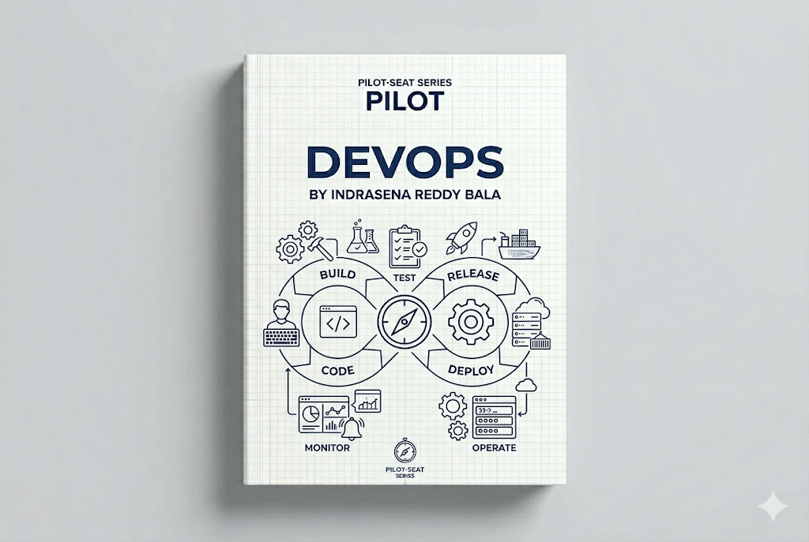

> **Mode:** Book
> **Pilot-Seat Standard**

---

# Introduction

DevOps is a culture, methodology, and set of practices that brings together **Development (Dev)** and **Operations (Ops)** teams to build, test, deploy, and maintain software efficiently.

Traditionally, developers wrote code and operations teams deployed and maintained it. This separation often caused delays, misunderstandings, and deployment failures.

DevOps removes these barriers by promoting collaboration, automation, continuous delivery, and shared responsibility.

---

# Why It Exists

Before DevOps:

```text
Developer
    ↓
Writes Code
    ↓
Hands Off To Ops
    ↓
Deployment Problems
    ↓
Blame Game
```

Common issues:

* Slow releases
* Deployment failures
* Environment mismatches
* Poor communication
* Long recovery times

DevOps was created to solve these challenges.

---

# Problem It Solves

Imagine a company releasing software.

Without DevOps:

```text
Development
    ↓
Testing
    ↓
Manual Deployment
    ↓
Production Issues
```

Problems:

* Weeks or months between releases
* High risk deployments
* Manual errors
* Difficult rollback

With DevOps:

```text
Code
 ↓
Build
 ↓
Test
 ↓
Deploy
 ↓
Monitor
```

Software can be delivered faster and more reliably.

---

# What is DevOps?

DevOps is not a tool.

DevOps is:

```text
Culture
+
Processes
+
Automation
+
Monitoring
```

The goal is:

```text
Faster Delivery
Higher Quality
Improved Reliability
```

---

# Core Objectives

DevOps aims to achieve:

```text
Collaboration
Automation
Continuous Delivery
Reliability
Scalability
Observability
Security
```

---

# Where DevOps Fits

## Software Development Lifecycle

```text
Planning
    ↓
Development
    ↓
Testing
    ↓
Deployment
    ↓
Monitoring
    ↓
Feedback
```

DevOps spans the entire lifecycle.

---

# DevOps Lifecycle

A typical DevOps lifecycle looks like:

```text
Plan
 ↓
Code
 ↓
Build
 ↓
Test
 ↓
Release
 ↓
Deploy
 ↓
Operate
 ↓
Monitor
 ↓
Feedback
```

This cycle continuously repeats.

---

# Core Concepts

```text
DevOps
│
├── Version Control
├── CI/CD
├── Infrastructure as Code
├── Containers
├── Orchestration
├── Monitoring
├── Logging
├── Security
└── Automation
```

---

# Version Control

Version control tracks changes in code.

Most teams use:

* Git

Platforms:

* [GitHub](https://github.com?utm_source=chatgpt.com)
* [GitLab](https://gitlab.com?utm_source=chatgpt.com)
* [Bitbucket](https://bitbucket.org?utm_source=chatgpt.com)

---

## Why Version Control Exists

Without version control:

```text
project-final.zip
project-final-final.zip
project-final-v2.zip
```

Chaos.

With version control:

```text
Commit History
Branching
Collaboration
Rollback
```

---

# Continuous Integration (CI)

Continuous Integration automatically validates code changes.

Workflow:

```text
Developer Pushes Code
          ↓
Build Starts
          ↓
Tests Run
          ↓
Validation Complete
```

Benefits:

* Early bug detection
* Consistent builds
* Faster feedback

---

# Continuous Delivery (CD)

Continuous Delivery ensures software is always deployable.

Workflow:

```text
Code
 ↓
Build
 ↓
Test
 ↓
Ready For Deployment
```

---

# Continuous Deployment

Continuous Deployment automatically releases successful changes.

Workflow:

```text
Code Push
 ↓
Build
 ↓
Test
 ↓
Production Deployment
```

No manual approval required.

---

# CI/CD Pipeline

A CI/CD pipeline automates software delivery.

Architecture:

```text
Developer
    ↓
Git Repository
    ↓
CI Pipeline
    ↓
Testing
    ↓
Build Artifact
    ↓
Deployment
    ↓
Production
```

---

# Infrastructure as Code (IaC)

Infrastructure should be defined using code.

Instead of:

```text
Manual Server Setup
```

Use:

```text
Configuration Files
```

Examples:

* Terraform
* AWS CloudFormation

---

## IaC Workflow

```text
Code
 ↓
Infrastructure Definition
 ↓
Automated Provisioning
```

Benefits:

* Reproducibility
* Version Control
* Automation

---

# Containers

Containers package applications and dependencies together.

Most popular tool:

* Docker

---

## Problem Containers Solve

Without containers:

```text
Works On My Machine
```

With containers:

```text
Same Environment Everywhere
```

---

## Container Architecture

```text
Application
      ↓
Container
      ↓
Host Machine
```

---

# Container Orchestration

Managing hundreds of containers manually is difficult.

Solution:

* Kubernetes

---

## Kubernetes Architecture

```text
Users
 ↓
Kubernetes Cluster
 ↓
Containers
```

Responsibilities:

* Scheduling
* Scaling
* Recovery
* Load Balancing

---

# Cloud Computing

Modern DevOps heavily relies on cloud platforms.

Major providers:

* Amazon Web Services
* Microsoft Azure
* Google Cloud

---

# Monitoring

Monitoring tracks system health.

Important metrics:

```text
CPU
Memory
Latency
Errors
Traffic
Availability
```

---

## Monitoring Workflow

```text
Application
 ↓
Metrics Collection
 ↓
Dashboard
 ↓
Alerts
```

---

# Observability

Observability helps understand system behavior.

Three pillars:

```text
Metrics
Logs
Traces
```

---

# Logging

Logs record system events.

Examples:

```text
User Login
API Request
Database Error
Payment Failure
```

Popular tools:

* ELK Stack
* Grafana Loki

---

# Security in DevOps (DevSecOps)

Security should be integrated into the pipeline.

Traditional:

```text
Development
 ↓
Security Later
```

DevSecOps:

```text
Development
 ↓
Security
 ↓
Testing
 ↓
Deployment
```

---

# DevOps Architecture

## Basic Architecture

```text
Developer
 ↓
Git
 ↓
Server
 ↓
Production
```

---

## Modern Architecture

```text
Developer
 ↓
GitHub
 ↓
CI/CD Pipeline
 ↓
Docker
 ↓
Kubernetes
 ↓
Cloud
 ↓
Monitoring
```

---

# End-to-End DevOps Workflow

```text
Developer Writes Code
          ↓
Git Commit
          ↓
Push To Repository
          ↓
CI Pipeline Triggered
          ↓
Automated Tests
          ↓
Build Docker Image
          ↓
Push Image To Registry
          ↓
Deploy To Kubernetes
          ↓
Application Runs
          ↓
Monitoring & Alerts
```

---

# Example: Deploying a Web Application

Requirements:

```text
Frontend
Backend
Database
```

Architecture:

```text
Users
 ↓
Load Balancer
 ↓
Frontend Containers
 ↓
Backend Containers
 ↓
Database
```

Deployment:

```text
GitHub
 ↓
GitHub Actions
 ↓
Docker Build
 ↓
Container Registry
 ↓
Kubernetes Deployment
```

---

# DevOps Workflow for Teams

```text
Developers
       ↓
Git Repository
       ↓
Pull Requests
       ↓
Code Review
       ↓
CI/CD Pipeline
       ↓
Deployment
       ↓
Monitoring
```

---

# Best Practices

## Automate Everything

### Problem

Manual processes create errors.

### Solution

Automate builds, testing, and deployments.

### Benefits

* Faster delivery
* Reduced mistakes

### Rollback

Revert pipeline changes.

---

## Use Infrastructure as Code

### Problem

Infrastructure drift.

### Solution

Manage infrastructure through code.

### Benefits

* Consistency
* Repeatability

### Rollback

Apply previous infrastructure version.

---

## Monitor Continuously

### Problem

Issues remain undetected.

### Solution

Implement monitoring and alerting.

### Benefits

* Faster recovery
* Better reliability

### Rollback

Adjust alert thresholds.

---

# Industry Standards

Modern DevOps stacks often include:

```text
Git
GitHub
GitLab

CI/CD
GitHub Actions
Jenkins

Containers
Docker

Orchestration
Kubernetes

Cloud
AWS
Azure
GCP

Monitoring
Prometheus
Grafana

Infrastructure
Terraform
```

---

# Common Mistakes

## Mistake 1

Treating DevOps as only a tool.

---

## Mistake 2

Skipping automated testing.

---

## Mistake 3

Manual deployments.

---

## Mistake 4

Ignoring monitoring.

---

## Mistake 5

Managing infrastructure manually.

---

# Security Considerations

Important areas:

```text
Secrets Management
Identity Access Control
Container Security
Dependency Scanning
Network Security
Encryption
Audit Logging
```

---

# Performance Considerations

Focus on:

```text
Pipeline Speed
Build Optimization
Auto Scaling
Caching
Resource Utilization
Container Efficiency
```

---

# Related Technologies

```text
Git
GitHub
CI/CD
Docker
Kubernetes
Terraform
AWS
Azure
GCP
Linux
Networking
Cloud Computing
System Design
```

---

# Suggested Projects

## Beginner

```text
Deploy Static Website
Dockerize Node.js App
CI/CD Pipeline Setup
```

---

## Intermediate

```text
Deploy MERN Application
Terraform Infrastructure
Monitoring Dashboard
```

---

## Advanced

```text
Kubernetes Cluster
Multi-Service SaaS Deployment
Production Cloud Platform
```

---

# Summary

## What We Learned

* What DevOps is
* DevOps lifecycle
* CI/CD
* Infrastructure as Code
* Containers
* Kubernetes
* Monitoring
* Observability
* DevSecOps

---

## Why It Matters

DevOps enables organizations to deliver software faster, safer, and more reliably.

Without DevOps:

```text
Slow Releases
Manual Processes
Frequent Failures
```

With DevOps:

```text
Automation
Continuous Delivery
Scalable Infrastructure
Reliable Systems
```

---

## Key Takeaways

* DevOps is a culture, not just a tool.
* Automation is the foundation of DevOps.
* CI/CD accelerates software delivery.
* Containers improve consistency.
* Kubernetes manages large-scale deployments.
* Monitoring is essential for production systems.
* Infrastructure should be managed as code.
* Security should be integrated from the beginning.

---

# Keywords

```text
DevOps
CI
CD
CI/CD
Git
GitHub
Docker
Kubernetes
Terraform
Infrastructure as Code
Monitoring
Observability
Logging
Cloud Computing
Automation
DevSecOps
Containers
Deployment
Pipeline
```

---

# Glossary

| Term          | Meaning                                         |
| ------------- | ----------------------------------------------- |
| DevOps        | Culture combining development and operations    |
| CI            | Continuous Integration                          |
| CD            | Continuous Delivery/Deployment                  |
| Pipeline      | Automated workflow for software delivery        |
| Container     | Package containing application and dependencies |
| Kubernetes    | Container orchestration platform                |
| IaC           | Infrastructure as Code                          |
| Monitoring    | Tracking system health                          |
| Observability | Understanding system behavior through telemetry |
| DevSecOps     | Integrating security into DevOps workflows      |

---

# Next Chapters

```text
07-DevOps/
│
├── 01-Linux Fundamentals
├── 02-Git & GitHub
├── 03-CI-CD Fundamentals
├── 04-GitHub Actions
├── 05-Docker
├── 06-Containerization
├── 07-Kubernetes
├── 08-Terraform
├── 09-Infrastructure as Code
├── 10-Monitoring & Observability
├── 11-Logging Systems
├── 12-Cloud Deployment
├── 13-DevSecOps
├── 14-SRE Fundamentals
└── 15-Production Operations
```

This chapter provides the foundation for understanding how modern software moves from a developer's machine to a secure, scalable, and monitored production environment.
