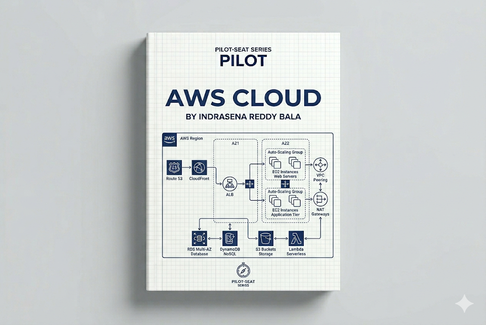

> **Mode:** Book
> **Pilot-Seat Standard**

---

# Introduction

AWS (Amazon Web Services) is a cloud computing platform that provides on-demand infrastructure, platforms, and services over the internet.

Instead of buying and maintaining physical servers, organizations can rent computing resources from AWS and pay only for what they use.

AWS is one of the world's largest cloud providers and powers startups, enterprises, governments, streaming platforms, SaaS products, and AI applications.

AWS provides hundreds of services covering:

* Computing
* Storage
* Networking
* Databases
* Security
* Analytics
* Artificial Intelligence
* DevOps
* Monitoring

Official Platform:

[Amazon Web Services (AWS)](https://aws.amazon.com?utm_source=chatgpt.com)

---

# Why It Exists

Before cloud computing, organizations had to:

```text
Buy Servers
Install Hardware
Configure Networks
Maintain Data Centers
Handle Failures
Upgrade Infrastructure
```

Problems:

* High upfront costs
* Long setup times
* Hardware maintenance
* Scaling difficulties
* Resource waste

Cloud computing solved these challenges.

---

# Problem It Solves

Imagine a startup launching a web application.

Without AWS:

```text
Buy Physical Servers
        ↓
Install Operating Systems
        ↓
Configure Networking
        ↓
Deploy Application
        ↓
Maintain Everything
```

With AWS:

```text
Create AWS Resources
        ↓
Deploy Application
        ↓
Scale As Needed
```

Benefits:

* Faster deployment
* Lower upfront costs
* Global availability
* High scalability

---

# What is Cloud Computing?

Cloud Computing is the delivery of computing services over the internet.

These services include:

```text
Servers
Storage
Databases
Networking
Security
Analytics
AI Services
```

Instead of owning infrastructure, users consume it as a service.

---

# What is AWS?

AWS is a collection of cloud services organized into categories.

```text
AWS
│
├── Compute
├── Storage
├── Networking
├── Databases
├── Security
├── Monitoring
├── Analytics
├── AI Services
└── DevOps Services
```

---

# Cloud Service Models

AWS provides services across different cloud models.

---

# Infrastructure as a Service (IaaS)

AWS provides infrastructure.

Example:

* Amazon EC2

You manage:

```text
Operating System
Application
Database
```

AWS manages:

```text
Physical Hardware
Networking
Data Centers
```

---

# Platform as a Service (PaaS)

AWS manages more infrastructure.

Example:

* AWS Elastic Beanstalk

You focus on:

```text
Code
Application Logic
```

---

# Software as a Service (SaaS)

Complete software delivered through the cloud.

Examples:

* Gmail
* Slack
* Notion

Users simply consume the service.

---

# AWS Global Infrastructure

AWS operates worldwide.

---

## Regions

A Region is a geographic location containing AWS data centers.

Examples:

* Mumbai Region
* Singapore Region
* US East Region

---

## Availability Zones (AZs)

Each region contains multiple Availability Zones.

Architecture:

```text
Region
│
├── AZ-1
├── AZ-2
└── AZ-3
```

Benefits:

* Fault tolerance
* High availability

---

## Edge Locations

Used by:

* Amazon CloudFront

Purpose:

```text
Serve Content Closer To Users
```

---

# AWS Architecture Overview

Basic Architecture:

```text
Users
 ↓
Internet
 ↓
AWS Cloud
 ↓
Application
 ↓
Database
```

Production Architecture:

```text
Users
 ↓
CloudFront
 ↓
Load Balancer
 ↓
EC2 Instances
 ↓
Database
```

---

# Compute Services

Compute services run applications.

---

# Amazon EC2

EC2 (Elastic Compute Cloud) provides virtual servers.

Purpose:

```text
Run Applications
Host Websites
Deploy APIs
```

Architecture:

```text
Application
 ↓
EC2 Instance
 ↓
AWS Infrastructure
```

---

## Common EC2 Workflow

```text
Launch EC2
 ↓
Install Software
 ↓
Deploy Application
 ↓
Serve Users
```

---

# AWS Lambda

AWS Lambda runs code without managing servers.

This model is called:

```text
Serverless Computing
```

Workflow:

```text
Event
 ↓
Lambda Function
 ↓
Execution
 ↓
Response
```

Benefits:

* No server management
* Automatic scaling
* Pay per execution

---

# Storage Services

Storage is required for files, backups, and application data.

---

# Amazon S3

S3 (Simple Storage Service) stores objects.

Examples:

```text
Images
Videos
Documents
Backups
Logs
```

Architecture:

```text
Application
 ↓
S3 Bucket
 ↓
Stored Files
```

---

## S3 Use Cases

```text
Website Assets
Media Storage
Backup Storage
Data Lakes
```

---

# Amazon EBS

Elastic Block Store provides storage for EC2 instances.

Think of it as:

```text
Virtual Hard Drive
```

---

# Networking Services

Networking connects AWS resources.

---

# Amazon VPC

VPC (Virtual Private Cloud) creates an isolated network.

Architecture:

```text
AWS Account
 ↓
VPC
 ↓
Subnets
 ↓
Resources
```

Benefits:

* Security
* Network control

---

# Route 53

Route 53 is AWS's DNS service.

Example:

```text
example.com
 ↓
IP Address
```

---

# Elastic Load Balancer (ELB)

Distributes traffic.

Architecture:

```text
Users
 ↓
Load Balancer
 ↓
Server A
Server B
Server C
```

Benefits:

* Scalability
* High availability

---

# Database Services

AWS offers managed databases.

---

# Amazon RDS

RDS (Relational Database Service)

Supports:

* PostgreSQL
* MySQL
* MariaDB

Benefits:

```text
Automated Backups
Scaling
Maintenance
```

---

# Amazon DynamoDB

NoSQL database service.

Architecture:

```text
Application
 ↓
DynamoDB
```

Benefits:

* High scalability
* Low latency

---

# Security Services

Security is a shared responsibility.

---

# AWS IAM

IAM (Identity and Access Management)

Controls:

```text
Users
Roles
Permissions
Policies
```

Example:

```text
Developer
 ↓
Limited Access

Administrator
 ↓
Full Access
```

---

# AWS KMS

Key Management Service.

Used for:

```text
Encryption Keys
```

---

# Monitoring Services

Monitoring is essential in production.

---

# Amazon CloudWatch

Collects:

```text
Logs
Metrics
Events
```

Tracks:

```text
CPU
Memory
Errors
Traffic
```

---

# DevOps Services

AWS provides deployment and automation tools.

Examples:

```text
CodePipeline
CodeBuild
CodeDeploy
```

Workflow:

```text
Code
 ↓
Build
 ↓
Test
 ↓
Deploy
```

---

# Container Services

AWS supports containerized applications.

---

# Amazon ECS

Elastic Container Service.

Runs:

* Docker containers

---

# Amazon EKS

Elastic Kubernetes Service.

Runs:

* Kubernetes clusters

Architecture:

```text
Users
 ↓
EKS Cluster
 ↓
Containers
```

---

# AWS Cloud Architecture

## Beginner Architecture

```text
Users
 ↓
EC2
 ↓
Database
```

---

## Production Architecture

```text
Users
 ↓
CloudFront
 ↓
Load Balancer
 ↓
EC2
 ↓
RDS
```

---

## Enterprise Architecture

```text
Users
 ↓
CloudFront
 ↓
API Gateway
 ↓
Microservices
 ↓
EKS
 ↓
Databases
 ↓
Monitoring
```

---

# Shared Responsibility Model

AWS does not manage everything.

AWS manages:

```text
Physical Servers
Networking
Data Centers
Hardware
```

Customers manage:

```text
Applications
Data
Access Control
Operating Systems
```

Understanding this model is critical.

---

# Typical AWS Deployment Workflow

```text
Developer
 ↓
GitHub
 ↓
CI/CD Pipeline
 ↓
Build
 ↓
Docker Image
 ↓
ECR
 ↓
ECS/EKS
 ↓
Production
```

---

# Best Practices

## Use IAM Roles

### Problem

Hardcoded credentials.

### Solution

Use IAM roles.

### Benefits

Improved security.

### Rollback

Rotate credentials and replace with IAM roles.

---

## Design for Multiple Availability Zones

### Problem

Single point of failure.

### Solution

Deploy across AZs.

### Benefits

High availability.

### Rollback

Failover to healthy AZ.

---

## Store Files in S3

### Problem

Application servers run out of storage.

### Solution

Store files in S3.

### Benefits

Durability and scalability.

### Rollback

Migrate files back to server storage if necessary.

---

# Industry Standards

Most production AWS systems use:

```text
EC2
S3
RDS
CloudFront
IAM
VPC
Lambda
EKS
CloudWatch
```

---

# Common Mistakes

## Mistake 1

Giving administrator access to everyone.

---

## Mistake 2

Ignoring cost monitoring.

---

## Mistake 3

Running everything in one Availability Zone.

---

## Mistake 4

Storing secrets in source code.

---

## Mistake 5

Not configuring backups.

---

# Security Considerations

Critical areas:

```text
IAM Policies
Encryption
Security Groups
Network Isolation
Secret Management
Multi-Factor Authentication
Audit Logging
```

---

# Performance Considerations

Focus on:

```text
Caching
CDN Usage
Auto Scaling
Database Optimization
Load Balancing
Monitoring
```

---

# Related Technologies

```text
Cloud Computing
Linux
Docker
Kubernetes
Terraform
DevOps
Networking
System Design
CI/CD
Security
```

---

# Suggested Projects

## Beginner

```text
Static Website on S3
Personal Portfolio Hosting
EC2 Web Server Deployment
```

---

## Intermediate

```text
Deploy MERN Stack
RDS + EC2 Application
Serverless API with Lambda
```

---

## Advanced

```text
Microservices on EKS
Multi-Region Deployment
Production SaaS Platform
High Availability Architecture
```

---

# Summary

## What We Learned

* What AWS is
* Cloud computing fundamentals
* AWS global infrastructure
* Compute services
* Storage services
* Networking services
* Database services
* Security services
* Monitoring services
* Cloud architectures

---

## Why It Matters

AWS allows organizations to build and scale applications without managing physical infrastructure.

It powers:

* Startups
* Enterprises
* SaaS Products
* AI Platforms
* Cloud-Native Applications

---

## Key Takeaways

* AWS is a cloud computing platform.
* Regions and Availability Zones provide reliability.
* EC2 runs servers.
* S3 stores files.
* RDS manages relational databases.
* IAM controls access.
* Lambda enables serverless computing.
* CloudWatch provides monitoring.
* Security is a shared responsibility.
* AWS supports applications from small websites to global-scale systems.

---

# Keywords

```text
AWS
Cloud Computing
EC2
S3
RDS
IAM
Lambda
CloudFront
VPC
Route 53
EKS
ECS
CloudWatch
Availability Zone
Region
Load Balancer
Serverless
DynamoDB
```

---

# Glossary

| Term              | Meaning                              |
| ----------------- | ------------------------------------ |
| AWS               | Amazon Web Services                  |
| Region            | Geographic AWS location              |
| Availability Zone | Isolated data center within a region |
| EC2               | Virtual server service               |
| S3                | Object storage service               |
| RDS               | Managed relational database service  |
| Lambda            | Serverless compute service           |
| IAM               | Identity and Access Management       |
| VPC               | Virtual Private Cloud                |
| CloudFront        | Content Delivery Network             |
| ELB               | Elastic Load Balancer                |
| DynamoDB          | Managed NoSQL database               |

---

# Next Chapters

```text
08-Cloud/
│
├── 01-Cloud Computing Fundamentals
├── 02-AWS Global Infrastructure
├── 03-IAM
├── 04-EC2
├── 05-S3
├── 06-VPC
├── 07-Route 53
├── 08-RDS
├── 09-DynamoDB
├── 10-Lambda
├── 11-CloudFront
├── 12-ECS
├── 13-EKS
├── 14-CloudWatch
├── 15-AWS Architecture Patterns
└── 16-Cost Optimization
```

This chapter serves as the foundation for understanding how AWS provides scalable, secure, and highly available cloud infrastructure for modern applications.
