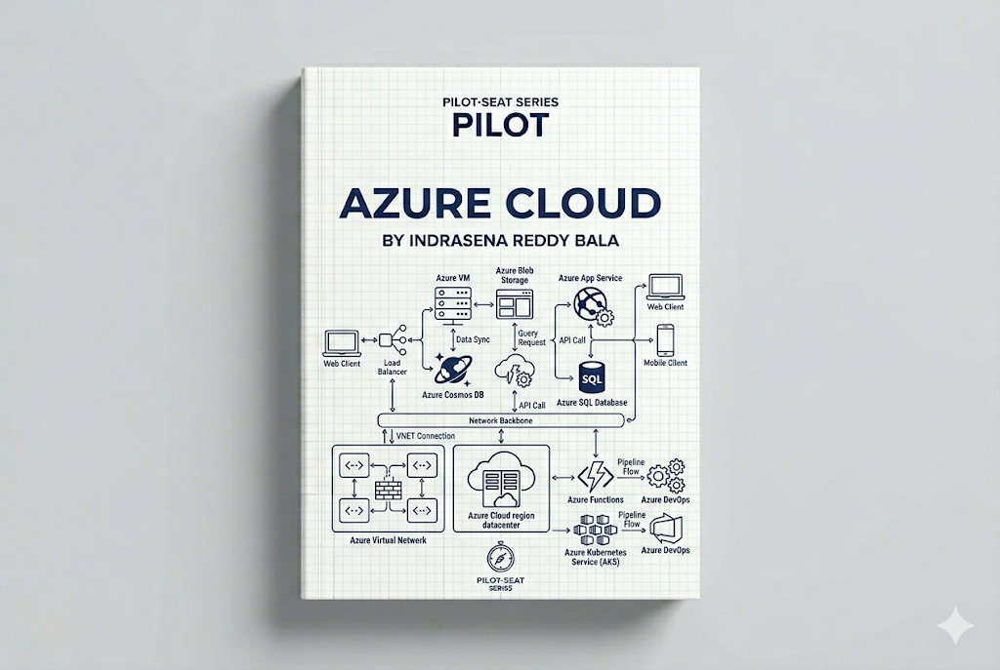

> **Mode:** Book
> **Pilot-Seat Standard**

---

# Introduction

Microsoft Azure is a cloud computing platform developed by [Microsoft Azure](https://azure.microsoft.com?utm_source=chatgpt.com) that provides on-demand computing, storage, networking, databases, analytics, AI services, and enterprise solutions.

Azure allows organizations to build, deploy, manage, and scale applications without owning physical infrastructure.

Today, Azure is one of the world's largest cloud platforms alongside:

* [Amazon Web Services (AWS)](https://aws.amazon.com?utm_source=chatgpt.com)
* [Google Cloud Platform (GCP)](https://cloud.google.com?utm_source=chatgpt.com)

Azure is particularly popular among enterprises because of its deep integration with:

* Windows Server
* Active Directory
* Microsoft 365
* .NET Ecosystem
* Enterprise Security Solutions

---

# Why It Exists

Before cloud computing:

```text
Organizations
        ↓
Purchase Hardware
        ↓
Build Data Centers
        ↓
Maintain Servers
        ↓
Manage Networking
        ↓
Deploy Applications
```

Challenges:

* High capital costs
* Long setup times
* Hardware failures
* Difficult scaling
* Infrastructure maintenance

Azure solves these challenges by providing cloud infrastructure and managed services.

---

# Problem It Solves

Imagine launching a new application.

Without Azure:

```text
Buy Servers
 ↓
Configure Hardware
 ↓
Install OS
 ↓
Setup Network
 ↓
Deploy Application
```

With Azure:

```text
Create Resources
 ↓
Deploy Application
 ↓
Scale Automatically
```

Benefits:

* Faster deployment
* Lower upfront investment
* Global availability
* Managed infrastructure

---

# What is Cloud Computing?

Cloud Computing is the delivery of computing services over the internet.

Services include:

```text
Compute
Storage
Networking
Databases
Security
AI
Analytics
```

Instead of buying hardware, organizations consume resources on demand.

---

# What is Azure?

Azure is a collection of cloud services.

```text
Azure
│
├── Compute
├── Storage
├── Networking
├── Databases
├── Security
├── Monitoring
├── Analytics
├── AI Services
└── DevOps Services
```

---

# Cloud Service Models

Azure supports the major cloud service models.

---

# Infrastructure as a Service (IaaS)

Provides virtual infrastructure.

Example:

* Azure Virtual Machines

Customer manages:

```text
Operating System
Applications
Data
```

Azure manages:

```text
Hardware
Networking
Physical Infrastructure
```

---

# Platform as a Service (PaaS)

Azure manages more infrastructure.

Example:

* Azure App Service

You focus on:

```text
Application Code
Business Logic
```

---

# Software as a Service (SaaS)

Complete software delivered through the cloud.

Examples:

* [Microsoft 365](https://www.microsoft.com/microsoft-365?utm_source=chatgpt.com)
* [Outlook](https://outlook.live.com?utm_source=chatgpt.com)

---

# Azure Global Infrastructure

Azure operates a worldwide network of data centers.

---

## Regions

A Region is a geographical area containing Azure data centers.

Examples:

* Central India
* East US
* West Europe

Benefits:

```text
Low Latency
Compliance
Disaster Recovery
```

---

## Availability Zones

Availability Zones are physically separate data centers within a region.

Architecture:

```text
Azure Region
│
├── Zone 1
├── Zone 2
└── Zone 3
```

Benefits:

* High availability
* Fault tolerance
* Disaster resilience

---

# Azure Architecture Overview

Basic Architecture:

```text
Users
 ↓
Internet
 ↓
Azure Cloud
 ↓
Application
 ↓
Database
```

Production Architecture:

```text
Users
 ↓
Azure Front Door
 ↓
Load Balancer
 ↓
Virtual Machines
 ↓
Database
```

---

# Compute Services

Compute services run applications and workloads.

---

# Azure Virtual Machines

Azure Virtual Machines (VMs) provide virtual servers.

Purpose:

```text
Host Applications
Run APIs
Deploy Databases
```

Architecture:

```text
Application
 ↓
Azure VM
 ↓
Azure Infrastructure
```

---

## VM Workflow

```text
Create VM
 ↓
Configure OS
 ↓
Install Software
 ↓
Deploy Application
```

---

# Azure App Service

Managed platform for hosting web applications.

Benefits:

```text
Automatic Scaling
Managed Infrastructure
Built-in Security
```

Architecture:

```text
Application Code
 ↓
Azure App Service
 ↓
Running Application
```

---

# Azure Functions

Serverless computing platform.

Workflow:

```text
Event
 ↓
Azure Function
 ↓
Execution
 ↓
Response
```

Benefits:

* No server management
* Pay per execution
* Auto scaling

---

# Storage Services

Applications require reliable storage.

---

# Azure Blob Storage

Stores unstructured data.

Examples:

```text
Images
Videos
Documents
Backups
Logs
```

Architecture:

```text
Application
 ↓
Blob Storage
 ↓
Stored Objects
```

---

## Blob Storage Use Cases

```text
Media Hosting
Data Lakes
Backups
Static Websites
```

---

# Azure Managed Disks

Provides persistent storage for virtual machines.

Think of it as:

```text
Virtual Hard Drive
```

---

# Networking Services

Networking connects Azure resources securely.

---

# Azure Virtual Network (VNet)

Azure's private network service.

Architecture:

```text
Azure Subscription
 ↓
VNet
 ↓
Subnets
 ↓
Resources
```

Benefits:

* Isolation
* Security
* Network Control

---

# Azure DNS

Provides domain name resolution.

Example:

```text
example.com
 ↓
IP Address
```

---

# Azure Load Balancer

Distributes traffic across resources.

Architecture:

```text
Users
 ↓
Load Balancer
 ↓
VM1
VM2
VM3
```

Benefits:

* High availability
* Traffic distribution
* Fault tolerance

---

# Database Services

Azure offers fully managed databases.

---

# Azure SQL Database

Managed relational database service.

Based on:

* Microsoft SQL Server

Benefits:

```text
Automated Backups
High Availability
Managed Maintenance
```

---

# Azure Database for PostgreSQL

Managed PostgreSQL service.

Based on:

* PostgreSQL

Use Cases:

```text
Web Applications
Microservices
Enterprise Systems
```

---

# Azure Cosmos DB

Globally distributed NoSQL database.

Benefits:

```text
Low Latency
Global Replication
Automatic Scaling
```

---

# Security Services

Security is a major focus of Azure.

---

# Microsoft Entra ID

Formerly known as Azure Active Directory.

Provides:

```text
Identity Management
Authentication
Single Sign-On
```

---

# Azure Key Vault

Stores:

```text
Secrets
Passwords
Certificates
Encryption Keys
```

Purpose:

```text
Secure Secret Management
```

---

# Monitoring Services

Monitoring helps maintain healthy systems.

---

# Azure Monitor

Collects:

```text
Metrics
Logs
Events
```

Tracks:

```text
CPU
Memory
Traffic
Errors
```

---

# Application Insights

Monitors application performance.

Provides:

```text
Request Tracking
Performance Metrics
Error Analysis
```

---

# DevOps Services

Azure provides deployment automation services.

---

# Azure DevOps

Supports:

```text
Repositories
Pipelines
Boards
Artifacts
Testing
```

Workflow:

```text
Code
 ↓
Build
 ↓
Test
 ↓
Deploy
```

Official Platform:

[Azure DevOps](https://azure.microsoft.com/products/devops?utm_source=chatgpt.com)

---

# Container Services

Azure supports containerized applications.

---

# Azure Container Instances (ACI)

Runs containers without managing servers.

---

# Azure Kubernetes Service (AKS)

Managed Kubernetes platform.

Architecture:

```text
Users
 ↓
AKS Cluster
 ↓
Containers
```

Benefits:

* Managed Kubernetes
* Auto scaling
* High availability

---

# Azure Cloud Architecture

## Beginner Architecture

```text
Users
 ↓
Virtual Machine
 ↓
Database
```

---

## Production Architecture

```text
Users
 ↓
Front Door
 ↓
Load Balancer
 ↓
App Service
 ↓
Azure SQL Database
```

---

## Enterprise Architecture

```text
Users
 ↓
Front Door
 ↓
API Gateway
 ↓
Microservices
 ↓
AKS
 ↓
Databases
 ↓
Monitoring
```

---

# Shared Responsibility Model

Azure does not manage everything.

Azure manages:

```text
Physical Hardware
Networking
Data Centers
Cloud Infrastructure
```

Customers manage:

```text
Applications
Data
Access Control
Configurations
```

---

# Typical Azure Deployment Workflow

```text
Developer
 ↓
GitHub
 ↓
CI/CD Pipeline
 ↓
Build
 ↓
Container Image
 ↓
Container Registry
 ↓
AKS Deployment
 ↓
Production
```

---

# Azure vs AWS

| Feature          | Azure                  | AWS             |
| ---------------- | ---------------------- | --------------- |
| Strength         | Enterprise Integration | Cloud Ecosystem |
| Identity         | Entra ID               | IAM             |
| Kubernetes       | AKS                    | EKS             |
| Virtual Machines | Azure VM               | EC2             |
| Object Storage   | Blob Storage           | S3              |
| Monitoring       | Azure Monitor          | CloudWatch      |

---

# Best Practices

## Use Managed Services

### Problem

Infrastructure maintenance overhead.

### Solution

Use App Service, Azure SQL, AKS.

### Benefits

* Less maintenance
* Better reliability

### Rollback

Migrate workloads to self-managed infrastructure.

---

## Use Entra ID for Authentication

### Problem

Poor identity management.

### Solution

Centralized authentication.

### Benefits

* Security
* Single Sign-On

### Rollback

Switch to local identity providers.

---

## Deploy Across Availability Zones

### Problem

Single point of failure.

### Solution

Multi-zone deployment.

### Benefits

High availability.

### Rollback

Failover to healthy zones.

---

# Industry Standards

Common Azure production stack:

```text
Azure VM
App Service
AKS
Blob Storage
Azure SQL
Cosmos DB
Entra ID
Key Vault
Azure Monitor
Azure DevOps
```

---

# Common Mistakes

## Mistake 1

Giving excessive permissions.

---

## Mistake 2

Ignoring cost optimization.

---

## Mistake 3

Not using managed services.

---

## Mistake 4

Hardcoding secrets.

---

## Mistake 5

Deploying in a single zone.

---

# Security Considerations

Critical areas:

```text
Identity Management
Role-Based Access Control
Encryption
Key Management
Network Security
Multi-Factor Authentication
Audit Logging
```

---

# Performance Considerations

Focus on:

```text
Caching
CDN Usage
Auto Scaling
Database Optimization
Load Balancing
Monitoring
```

---

# Related Technologies

```text
Cloud Computing
AWS
Google Cloud
Docker
Kubernetes
Terraform
DevOps
Networking
System Design
Security
```

---

# Suggested Projects

## Beginner

```text
Host Portfolio on Azure App Service
Deploy API on Azure VM
Store Files in Blob Storage
```

---

## Intermediate

```text
Deploy MERN Application
AKS Deployment
Serverless API with Azure Functions
```

---

## Advanced

```text
Multi-Region Architecture
Microservices on AKS
Enterprise SaaS Platform
High Availability Deployment
```

---

# Summary

## What We Learned

* What Azure is
* Cloud computing fundamentals
* Azure infrastructure
* Compute services
* Storage services
* Networking services
* Database services
* Security services
* Monitoring services
* Azure architectures

---

## Why It Matters

Azure provides scalable, secure, and enterprise-ready cloud infrastructure for modern applications.

It is widely adopted by:

* Enterprises
* Government organizations
* Financial institutions
* SaaS companies
* Cloud-native startups

---

## Key Takeaways

* Azure is Microsoft's cloud platform.
* Regions and Availability Zones provide resilience.
* Virtual Machines run workloads.
* Blob Storage stores files.
* Azure SQL stores relational data.
* Cosmos DB provides globally distributed NoSQL storage.
* Entra ID manages identity.
* AKS runs Kubernetes workloads.
* Azure Monitor provides observability.
* Azure enables applications to scale globally.

---

# Keywords

```text
Azure
Cloud Computing
Azure VM
App Service
Blob Storage
AKS
Azure SQL
Cosmos DB
Entra ID
Key Vault
Azure Monitor
Azure DevOps
Availability Zone
Region
Load Balancer
Serverless
Azure Functions
```

---

# Glossary

| Term               | Meaning                                |
| ------------------ | -------------------------------------- |
| Azure              | Microsoft's cloud platform             |
| Region             | Geographic Azure location              |
| Availability Zone  | Isolated data center within a region   |
| Azure VM           | Virtual server service                 |
| Blob Storage       | Object storage service                 |
| Azure SQL Database | Managed SQL database service           |
| Cosmos DB          | Distributed NoSQL database             |
| Entra ID           | Identity and access management service |
| AKS                | Azure Kubernetes Service               |
| Azure Functions    | Serverless compute service             |
| VNet               | Virtual network service                |
| Key Vault          | Secret management service              |

---

# Next Chapters

```text
08-Cloud/
│
├── 01-Cloud Computing Fundamentals
├── 02-Azure Global Infrastructure
├── 03-Entra ID
├── 04-Azure Virtual Machines
├── 05-Blob Storage
├── 06-VNet
├── 07-Azure DNS
├── 08-Azure SQL Database
├── 09-Cosmos DB
├── 10-Azure Functions
├── 11-Front Door
├── 12-Container Services
├── 13-AKS
├── 14-Azure Monitor
├── 15-Azure Architecture Patterns
└── 16-Cost Optimization
```

This chapter establishes the foundation for understanding Azure's cloud ecosystem and how modern applications are deployed, secured, monitored, and scaled on Microsoft's cloud platform.
