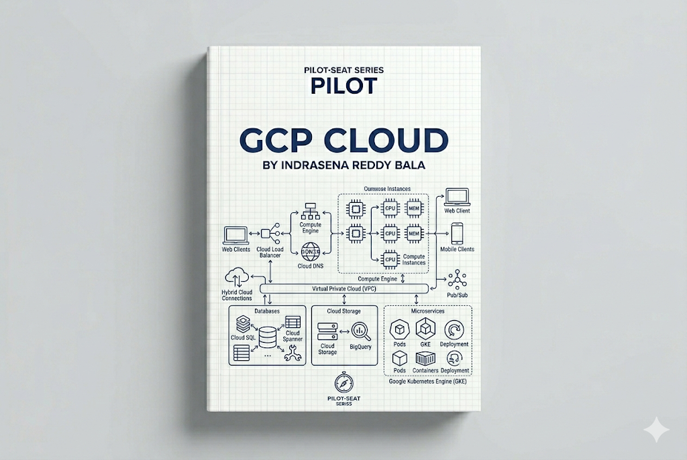

> **Mode:** Book
> **Pilot-Seat Standard**

---

# Introduction

Google Cloud Platform (GCP) is a cloud computing platform provided by [Google Cloud Platform](https://cloud.google.com?utm_source=chatgpt.com) that offers computing, storage, networking, databases, analytics, artificial intelligence, machine learning, and infrastructure services.

GCP allows organizations to build, deploy, manage, and scale applications without owning physical hardware.

Google Cloud powers many of Google's own products, including:

* [Google Search](https://www.google.com?utm_source=chatgpt.com)
* [YouTube](https://www.youtube.com?utm_source=chatgpt.com)
* [Gmail](https://mail.google.com?utm_source=chatgpt.com)
* [Google Maps](https://maps.google.com?utm_source=chatgpt.com)

This gives GCP a strong reputation for:

* Global scale
* Data analytics
* AI and Machine Learning
* Kubernetes
* Cloud-native architectures

---

# Why It Exists

Traditionally, companies needed to:

```text
Purchase Servers
Install Hardware
Manage Data Centers
Configure Networks
Deploy Applications
```

Challenges:

* High capital expenses
* Infrastructure maintenance
* Hardware failures
* Scaling limitations
* Long provisioning times

GCP eliminates these challenges by offering infrastructure and services on demand.

---

# Problem It Solves

Imagine launching a SaaS application.

Without GCP:

```text
Buy Hardware
 ↓
Configure Infrastructure
 ↓
Install Software
 ↓
Deploy Application
```

With GCP:

```text
Create Cloud Resources
 ↓
Deploy Application
 ↓
Scale Automatically
```

Benefits:

* Faster development
* Lower operational overhead
* Global deployment
* Managed infrastructure

---

# What is Cloud Computing?

Cloud Computing is the delivery of computing services over the internet.

Services include:

```text
Compute
Storage
Networking
Databases
Analytics
AI
Security
```

Organizations consume resources as needed and pay based on usage.

---

# What is GCP?

GCP is a collection of cloud services.

```text
GCP
│
├── Compute
├── Storage
├── Networking
├── Databases
├── Analytics
├── AI & ML
├── Security
├── Monitoring
└── DevOps
```

---

# Cloud Service Models

---

# Infrastructure as a Service (IaaS)

Provides virtual infrastructure.

Example:

* Google Compute Engine

Customer manages:

```text
Operating System
Applications
Data
```

Google manages:

```text
Hardware
Networking
Data Centers
```

---

# Platform as a Service (PaaS)

Managed application platforms.

Example:

* Google App Engine

Developers focus on:

```text
Application Code
Business Logic
```

---

# Software as a Service (SaaS)

Fully managed software applications.

Examples:

* [Google Workspace](https://workspace.google.com?utm_source=chatgpt.com)
* [Gmail](https://mail.google.com?utm_source=chatgpt.com)

---

# GCP Global Infrastructure

Google operates one of the world's largest private networks.

---

## Regions

A Region is a geographical area containing cloud resources.

Examples:

* Mumbai
* Singapore
* Iowa

Benefits:

```text
Low Latency
Compliance
Disaster Recovery
```

---

## Zones

Each region contains multiple zones.

Architecture:

```text
Region
│
├── Zone A
├── Zone B
└── Zone C
```

Benefits:

* Fault isolation
* High availability
* Disaster resilience

---

# GCP Architecture Overview

Basic Architecture:

```text
Users
 ↓
Internet
 ↓
Google Cloud
 ↓
Application
 ↓
Database
```

Production Architecture:

```text
Users
 ↓
Cloud CDN
 ↓
Load Balancer
 ↓
Compute Instances
 ↓
Database
```

---

# Compute Services

Compute services execute applications and workloads.

---

# Compute Engine

Google's virtual machine service.

Purpose:

```text
Host Applications
Deploy APIs
Run Databases
```

Architecture:

```text
Application
 ↓
Compute Engine VM
 ↓
Google Infrastructure
```

Workflow:

```text
Create VM
 ↓
Configure OS
 ↓
Deploy Application
```

---

# App Engine

Managed platform for web applications.

Benefits:

```text
Auto Scaling
Managed Infrastructure
Reduced Operations
```

Architecture:

```text
Code
 ↓
App Engine
 ↓
Running Application
```

---

# Cloud Functions

Serverless execution platform.

Workflow:

```text
Event
 ↓
Cloud Function
 ↓
Execution
 ↓
Response
```

Benefits:

* No server management
* Automatic scaling
* Pay per execution

---

# Cloud Run

Runs containerized applications without managing servers.

Architecture:

```text
Container
 ↓
Cloud Run
 ↓
Auto Scaling Service
```

Benefits:

* Serverless containers
* Fast deployment
* Kubernetes-compatible workloads

---

# Storage Services

Applications need durable storage.

---

# Cloud Storage

Object storage service.

Stores:

```text
Images
Videos
Documents
Backups
Logs
```

Architecture:

```text
Application
 ↓
Cloud Storage Bucket
 ↓
Stored Objects
```

---

## Use Cases

```text
Media Hosting
Backups
Data Lakes
Static Websites
```

---

# Persistent Disk

Block storage attached to virtual machines.

Think of it as:

```text
Virtual Hard Drive
```

---

# Networking Services

Networking securely connects resources.

---

# Virtual Private Cloud (VPC)

Private network environment.

Architecture:

```text
Project
 ↓
VPC
 ↓
Subnets
 ↓
Resources
```

Benefits:

* Isolation
* Security
* Network Management

---

# Cloud DNS

Provides domain name resolution.

Example:

```text
example.com
 ↓
IP Address
```

---

# Cloud Load Balancing

Distributes traffic across resources.

Architecture:

```text
Users
 ↓
Load Balancer
 ↓
VM1
VM2
VM3
```

Benefits:

* High availability
* Scalability
* Traffic distribution

---

# Database Services

GCP provides managed databases.

---

# Cloud SQL

Managed relational database service.

Supports:

* PostgreSQL
* MySQL
* SQL Server

Benefits:

```text
Automatic Backups
Maintenance
Scaling
```

---

# Firestore

Serverless NoSQL database.

Architecture:

```text
Application
 ↓
Firestore
```

Benefits:

* Real-time synchronization
* Automatic scaling

---

# Bigtable

Distributed NoSQL database.

Best for:

```text
Large Scale Data
IoT
Analytics
```

---

# BigQuery

One of GCP's flagship services.

Purpose:

```text
Data Analytics
Data Warehousing
Business Intelligence
```

Architecture:

```text
Data Sources
 ↓
BigQuery
 ↓
Analytics
```

Benefits:

* Massive scale
* Fast analytical queries

---

# Security Services

Security is a fundamental cloud responsibility.

---

# Cloud IAM

Identity and Access Management.

Controls:

```text
Users
Roles
Permissions
Policies
```

Example:

```text
Developer
 ↓
Limited Access

Administrator
 ↓
Full Access
```

---

# Secret Manager

Stores:

```text
Passwords
API Keys
Certificates
Secrets
```

Purpose:

```text
Secure Credential Storage
```

---

# Monitoring Services

Production systems require monitoring.

---

# Cloud Monitoring

Tracks:

```text
CPU
Memory
Network
Errors
Latency
```

---

# Cloud Logging

Collects:

```text
Application Logs
System Logs
Audit Logs
```

---

# DevOps Services

GCP supports modern DevOps workflows.

---

# Cloud Build

Automated build service.

Workflow:

```text
Code
 ↓
Build
 ↓
Test
 ↓
Deploy
```

---

# Artifact Registry

Stores:

```text
Docker Images
Packages
Artifacts
```

---

# Container Services

Google created Kubernetes.

As a result, GCP has strong container support.

---

# Google Kubernetes Engine (GKE)

Managed Kubernetes platform.

Architecture:

```text
Users
 ↓
GKE Cluster
 ↓
Containers
```

Benefits:

* Managed Kubernetes
* Auto Scaling
* Production Reliability

---

# GCP Cloud Architecture

## Beginner Architecture

```text
Users
 ↓
VM Instance
 ↓
Database
```

---

## Production Architecture

```text
Users
 ↓
Cloud CDN
 ↓
Load Balancer
 ↓
Cloud Run
 ↓
Cloud SQL
```

---

## Enterprise Architecture

```text
Users
 ↓
Cloud CDN
 ↓
API Gateway
 ↓
Microservices
 ↓
GKE
 ↓
Databases
 ↓
Monitoring
```

---

# Shared Responsibility Model

Google manages:

```text
Physical Infrastructure
Hardware
Networking
Data Centers
```

Customers manage:

```text
Applications
Data
Access Control
Configurations
```

---

# AI and Machine Learning Services

One area where GCP stands out.

---

# Vertex AI

Managed AI and machine learning platform.

Purpose:

```text
Train Models
Deploy Models
Manage AI Workloads
```

Benefits:

* MLOps support
* Foundation model integration
* Enterprise AI workflows

---

# Typical GCP Deployment Workflow

```text
Developer
 ↓
GitHub
 ↓
Cloud Build
 ↓
Container Image
 ↓
Artifact Registry
 ↓
Cloud Run / GKE
 ↓
Production
```

---

# GCP vs AWS vs Azure

| Feature        | GCP              | AWS                   | Azure                  |
| -------------- | ---------------- | --------------------- | ---------------------- |
| Strength       | Analytics & AI   | Broad Service Catalog | Enterprise Integration |
| Kubernetes     | GKE              | EKS                   | AKS                    |
| VM Service     | Compute Engine   | EC2                   | Azure VM               |
| Object Storage | Cloud Storage    | S3                    | Blob Storage           |
| Monitoring     | Cloud Monitoring | CloudWatch            | Azure Monitor          |
| AI Platform    | Vertex AI        | SageMaker             | Azure AI               |

---

# Best Practices

## Use Managed Services

### Problem

Infrastructure management overhead.

### Solution

Use Cloud Run, Cloud SQL, Firestore.

### Benefits

* Reduced operations
* Faster development

### Rollback

Move to self-managed infrastructure.

---

## Use IAM Roles

### Problem

Excessive permissions.

### Solution

Apply least-privilege access.

### Benefits

Improved security.

### Rollback

Review and update role assignments.

---

## Design for Multiple Zones

### Problem

Single point of failure.

### Solution

Deploy across zones.

### Benefits

High availability.

### Rollback

Failover to healthy zones.

---

# Industry Standards

Common production GCP stack:

```text
Compute Engine
Cloud Run
Cloud Storage
Cloud SQL
Firestore
BigQuery
GKE
Cloud Monitoring
IAM
Vertex AI
```

---

# Common Mistakes

## Mistake 1

Ignoring IAM best practices.

---

## Mistake 2

Hardcoding secrets.

---

## Mistake 3

Not monitoring costs.

---

## Mistake 4

Running everything in one zone.

---

## Mistake 5

Ignoring backups and disaster recovery.

---

# Security Considerations

Critical areas:

```text
Identity Management
Role-Based Access Control
Encryption
Secret Management
Network Security
Audit Logging
```

---

# Performance Considerations

Focus on:

```text
Caching
CDN Usage
Auto Scaling
Database Optimization
Load Balancing
Monitoring
```

---

# Related Technologies

```text
Cloud Computing
AWS
Azure
Docker
Kubernetes
Terraform
DevOps
System Design
Data Engineering
Artificial Intelligence
```

---

# Suggested Projects

## Beginner

```text
Static Website Hosting
Cloud Storage Portfolio
Deploy API on Compute Engine
```

---

## Intermediate

```text
Deploy MERN Application
Cloud Run Application
Firestore-Based App
```

---

## Advanced

```text
Microservices on GKE
BigQuery Analytics Platform
AI Application with Vertex AI
Multi-Region SaaS Architecture
```

---

# Summary

## What We Learned

* What GCP is
* Cloud computing fundamentals
* Global infrastructure
* Compute services
* Storage services
* Networking services
* Database services
* AI services
* Monitoring services
* Cloud architectures

---

## Why It Matters

GCP provides scalable infrastructure, powerful analytics, and advanced AI capabilities for modern applications.

It is widely used for:

* Cloud-native applications
* Data engineering
* Machine learning
* Kubernetes workloads
* Global-scale systems

---

## Key Takeaways

* GCP is Google's cloud platform.
* Regions and Zones provide resilience.
* Compute Engine runs virtual machines.
* Cloud Storage stores files.
* Cloud SQL manages relational databases.
* BigQuery powers large-scale analytics.
* GKE runs Kubernetes workloads.
* Vertex AI supports AI and ML workloads.
* Cloud Monitoring provides observability.
* GCP excels in analytics, AI, and cloud-native architectures.

---

# Keywords

```text
GCP
Google Cloud
Compute Engine
Cloud Storage
Cloud SQL
Firestore
BigQuery
GKE
Cloud Run
Cloud Functions
IAM
Cloud Monitoring
Vertex AI
Region
Zone
Load Balancer
Serverless
```

---

# Glossary

| Term           | Meaning                                      |
| -------------- | -------------------------------------------- |
| GCP            | Google Cloud Platform                        |
| Region         | Geographic cloud location                    |
| Zone           | Isolated deployment location within a region |
| Compute Engine | Virtual machine service                      |
| Cloud Storage  | Object storage service                       |
| Cloud SQL      | Managed relational database                  |
| Firestore      | Serverless NoSQL database                    |
| BigQuery       | Data warehouse and analytics platform        |
| GKE            | Google Kubernetes Engine                     |
| Cloud Run      | Serverless container platform                |
| Vertex AI      | AI and machine learning platform             |
| IAM            | Identity and Access Management               |

---

# Next Chapters

```text
08-Cloud/
│
├── 01-Cloud Computing Fundamentals
├── 02-GCP Global Infrastructure
├── 03-IAM
├── 04-Compute Engine
├── 05-Cloud Storage
├── 06-VPC
├── 07-Cloud DNS
├── 08-Cloud SQL
├── 09-Firestore
├── 10-BigQuery
├── 11-Cloud Run
├── 12-GKE
├── 13-Vertex AI
├── 14-Cloud Monitoring
├── 15-GCP Architecture Patterns
└── 16-Cost Optimization
```

This chapter provides the foundation for understanding Google Cloud Platform and how organizations build scalable, data-driven, AI-powered, and cloud-native systems on Google's infrastructure.
