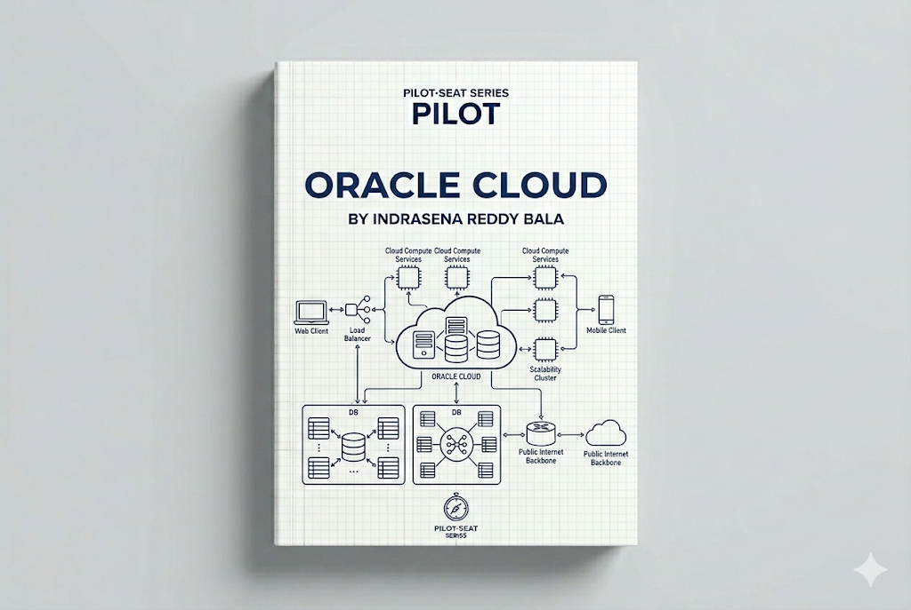

> **Mode:** Book
> **Pilot-Seat Standard**

---

# Introduction

Oracle Cloud Infrastructure (OCI) is a cloud computing platform provided by [Oracle Cloud Infrastructure](https://www.oracle.com/cloud/?utm_source=chatgpt.com) that offers computing, storage, networking, databases, analytics, artificial intelligence, and enterprise cloud services.

OCI enables organizations to build, deploy, manage, and scale applications without maintaining physical infrastructure.

Oracle Cloud is particularly well known for:

* Enterprise Applications
* Oracle Databases
* Financial Systems
* ERP Platforms
* High-Performance Computing (HPC)
* Hybrid Cloud Solutions

Many large enterprises use Oracle Cloud to run mission-critical workloads such as banking, healthcare, manufacturing, government systems, and large-scale business applications.

---

# Why It Exists

Before cloud platforms:

```text
Organizations
        ↓
Purchase Hardware
        ↓
Build Data Centers
        ↓
Install Software
        ↓
Manage Infrastructure
```

Challenges:

* High capital investment
* Infrastructure maintenance
* Long provisioning times
* Scaling difficulties
* Disaster recovery complexity

Oracle Cloud solves these challenges by providing infrastructure and services on demand.

---

# Problem It Solves

Imagine a company running an ERP system.

Without Oracle Cloud:

```text
Purchase Servers
 ↓
Install Database
 ↓
Configure Network
 ↓
Deploy ERP System
 ↓
Maintain Everything
```

With Oracle Cloud:

```text
Provision Cloud Resources
 ↓
Deploy ERP Application
 ↓
Scale As Required
```

Benefits:

* Faster deployment
* Reduced operational overhead
* Enterprise-grade security
* Global accessibility

---

# What is Cloud Computing?

Cloud Computing is the delivery of computing resources over the internet.

Services include:

```text
Compute
Storage
Networking
Databases
Security
Analytics
AI Services
```

Organizations consume resources when needed and pay based on usage.

---

# What is OCI?

Oracle Cloud Infrastructure is a collection of cloud services.

```text
OCI
│
├── Compute
├── Storage
├── Networking
├── Databases
├── Security
├── Analytics
├── AI Services
├── Monitoring
└── DevOps
```

---

# Cloud Service Models

---

# Infrastructure as a Service (IaaS)

Provides virtual infrastructure.

Example:

* OCI Compute

Customer manages:

```text
Operating System
Applications
Data
```

Oracle manages:

```text
Hardware
Networking
Data Centers
```

---

# Platform as a Service (PaaS)

Provides managed platforms.

Examples:

* Oracle Autonomous Database
* Oracle Integration Cloud

Developers focus on:

```text
Application Logic
Business Processes
```

---

# Software as a Service (SaaS)

Fully managed business applications.

Examples:

* Oracle Fusion Cloud ERP
* Oracle Fusion Cloud HCM
* Oracle CX Cloud

---

# OCI Global Infrastructure

OCI operates globally distributed cloud regions.

---

## Regions

A Region is a geographical deployment area.

Examples:

* Mumbai
* Hyderabad
* Frankfurt

Benefits:

```text
Low Latency
Compliance
Regional Redundancy
```

---

## Availability Domains

OCI uses Availability Domains instead of Availability Zones.

Architecture:

```text
Region
│
├── Availability Domain 1
├── Availability Domain 2
└── Availability Domain 3
```

Benefits:

* Fault isolation
* High availability
* Disaster resilience

---

# OCI Architecture Overview

Basic Architecture:

```text
Users
 ↓
Internet
 ↓
Oracle Cloud
 ↓
Application
 ↓
Database
```

Production Architecture:

```text
Users
 ↓
Load Balancer
 ↓
Compute Instances
 ↓
Oracle Database
```

---

# Compute Services

Compute services execute workloads.

---

# OCI Compute

Provides virtual machines and bare metal servers.

Purpose:

```text
Host Applications
Run APIs
Deploy Enterprise Systems
```

Architecture:

```text
Application
 ↓
OCI Compute
 ↓
Oracle Infrastructure
```

---

## Compute Workflow

```text
Launch Instance
 ↓
Configure Operating System
 ↓
Install Application
 ↓
Deploy Services
```

---

# Bare Metal Servers

OCI is known for offering powerful bare metal servers.

Benefits:

```text
High Performance
Dedicated Resources
Enterprise Workloads
```

Use Cases:

```text
Databases
AI Training
HPC
Large Enterprise Applications
```

---

# Storage Services

Applications require reliable storage.

---

# Object Storage

Stores unstructured data.

Examples:

```text
Images
Videos
Backups
Logs
Documents
```

Architecture:

```text
Application
 ↓
Object Storage
 ↓
Stored Files
```

---

# Block Storage

Provides persistent storage for compute instances.

Think of it as:

```text
Virtual Hard Drive
```

---

# File Storage

Provides shared file systems.

Use Cases:

```text
Enterprise Applications
Shared Data Access
```

---

# Networking Services

OCI networking connects cloud resources securely.

---

# Virtual Cloud Network (VCN)

OCI's private networking service.

Architecture:

```text
OCI Tenancy
 ↓
VCN
 ↓
Subnets
 ↓
Resources
```

Benefits:

* Network Isolation
* Security
* Routing Control

---

# DNS Service

Provides domain name resolution.

Example:

```text
example.com
 ↓
IP Address
```

---

# Load Balancer

Distributes traffic across servers.

Architecture:

```text
Users
 ↓
Load Balancer
 ↓
Server A
Server B
Server C
```

Benefits:

* High availability
* Fault tolerance
* Scalability

---

# Database Services

Databases are Oracle's strongest area.

---

# Oracle Database Service

Managed Oracle database service.

Benefits:

```text
Automatic Backups
High Availability
Managed Maintenance
```

---

# Autonomous Database

One of Oracle Cloud's flagship services.

Purpose:

```text
Self-Managing Database
```

Capabilities:

```text
Automatic Tuning
Automatic Patching
Automatic Scaling
Automatic Backup
```

Architecture:

```text
Application
 ↓
Autonomous Database
```

Benefits:

* Reduced administration
* Improved security
* Optimized performance

---

# MySQL HeatWave

Managed MySQL service.

Features:

```text
Analytics
Machine Learning
Transaction Processing
```

Based on:

* MySQL

---

# Security Services

Security is a critical component of OCI.

---

# Identity and Access Management (IAM)

Controls:

```text
Users
Groups
Policies
Permissions
```

Example:

```text
Developer
 ↓
Limited Access

Administrator
 ↓
Full Access
```

---

# OCI Vault

Stores:

```text
Secrets
Passwords
Encryption Keys
Certificates
```

Purpose:

```text
Secure Secret Management
```

---

# Monitoring Services

Production systems require visibility.

---

# OCI Monitoring

Tracks:

```text
CPU
Memory
Network
Storage
Errors
```

---

# Logging Service

Collects:

```text
Application Logs
Audit Logs
System Logs
```

Purpose:

```text
Troubleshooting
Compliance
Security
```

---

# DevOps Services

OCI provides DevOps automation capabilities.

---

# OCI DevOps

Supports:

```text
Source Code Management
Build Pipelines
Deployment Pipelines
Automation
```

Workflow:

```text
Code
 ↓
Build
 ↓
Test
 ↓
Deploy
```

---

# Container Services

OCI supports modern containerized applications.

---

# OCI Container Instances

Runs containers without managing servers.

---

# Oracle Kubernetes Engine (OKE)

Managed Kubernetes platform.

Architecture:

```text
Users
 ↓
OKE Cluster
 ↓
Containers
```

Benefits:

* Managed Kubernetes
* Auto Scaling
* High Availability

---

# Oracle Cloud Architecture

## Beginner Architecture

```text
Users
 ↓
Compute Instance
 ↓
Database
```

---

## Production Architecture

```text
Users
 ↓
Load Balancer
 ↓
Compute Instances
 ↓
Autonomous Database
```

---

## Enterprise Architecture

```text
Users
 ↓
API Gateway
 ↓
Microservices
 ↓
OKE
 ↓
Databases
 ↓
Monitoring
```

---

# Shared Responsibility Model

Oracle manages:

```text
Physical Infrastructure
Hardware
Data Centers
Networking Backbone
```

Customers manage:

```text
Applications
Data
User Access
Configurations
```

---

# Oracle Cloud Deployment Workflow

```text
Developer
 ↓
Git Repository
 ↓
Build Pipeline
 ↓
Container Registry
 ↓
OKE Deployment
 ↓
Production
```

---

# Oracle Cloud Strengths

OCI is particularly strong in:

```text
Enterprise Workloads
Oracle Databases
ERP Systems
Financial Applications
Hybrid Cloud
High Performance Computing
```

---

# OCI vs AWS vs Azure vs GCP

| Feature          | OCI                        | AWS             | Azure                  | GCP            |
| ---------------- | -------------------------- | --------------- | ---------------------- | -------------- |
| Strength         | Database & Enterprise Apps | Service Breadth | Enterprise Integration | Analytics & AI |
| Kubernetes       | OKE                        | EKS             | AKS                    | GKE            |
| VM Service       | OCI Compute                | EC2             | Azure VM               | Compute Engine |
| Object Storage   | Object Storage             | S3              | Blob Storage           | Cloud Storage  |
| Managed Database | Autonomous DB              | RDS             | Azure SQL              | Cloud SQL      |
| AI Focus         | Growing                    | Strong          | Strong                 | Very Strong    |

---

# Best Practices

## Use IAM Policies

### Problem

Excessive permissions.

### Solution

Implement least-privilege access.

### Benefits

Improved security.

### Rollback

Review and adjust policies.

---

## Use Autonomous Database

### Problem

Manual database administration.

### Solution

Leverage Autonomous Database.

### Benefits

* Reduced maintenance
* Better performance

### Rollback

Migrate to traditional database services.

---

## Deploy Across Availability Domains

### Problem

Single point of failure.

### Solution

Multi-domain deployment.

### Benefits

High availability.

### Rollback

Failover to healthy domains.

---

# Industry Standards

Common OCI production stack:

```text
OCI Compute
Object Storage
Autonomous Database
MySQL HeatWave
VCN
OKE
IAM
Vault
Monitoring
DevOps Pipelines
```

---

# Common Mistakes

## Mistake 1

Ignoring IAM policies.

---

## Mistake 2

Hardcoding secrets.

---

## Mistake 3

Not enabling backups.

---

## Mistake 4

Deploying in a single availability domain.

---

## Mistake 5

Ignoring cost management.

---

# Security Considerations

Critical areas:

```text
Identity Management
Role-Based Access Control
Encryption
Secret Management
Network Security
Audit Logging
Compliance
```

---

# Performance Considerations

Focus on:

```text
Database Optimization
Auto Scaling
Caching
Load Balancing
Monitoring
Storage Performance
```

---

# Related Technologies

```text
Cloud Computing
AWS
Azure
GCP
Docker
Kubernetes
Terraform
DevOps
System Design
Enterprise Architecture
```

---

# Suggested Projects

## Beginner

```text
Host Website on OCI Compute
Object Storage File Hosting
Deploy Basic API
```

---

## Intermediate

```text
Deploy MERN Application
OKE Deployment
Autonomous Database Integration
```

---

## Advanced

```text
Enterprise ERP Deployment
Microservices on OKE
High Availability SaaS Platform
Multi-Region Architecture
```

---

# Summary

## What We Learned

* What Oracle Cloud Infrastructure is
* Cloud computing fundamentals
* OCI infrastructure
* Compute services
* Storage services
* Networking services
* Database services
* Security services
* Monitoring services
* Enterprise cloud architectures

---

## Why It Matters

OCI provides enterprise-grade cloud infrastructure with particular strength in databases, business applications, and high-performance workloads.

It is widely adopted by:

* Enterprises
* Financial institutions
* Government organizations
* ERP providers
* Large database-driven applications

---

## Key Takeaways

* OCI is Oracle's cloud platform.
* Availability Domains provide resilience.
* OCI Compute runs workloads.
* Object Storage stores files.
* Autonomous Database is a key differentiator.
* IAM manages access.
* OKE provides managed Kubernetes.
* OCI is strong in enterprise and database workloads.
* Security follows a shared responsibility model.
* OCI supports applications from small deployments to enterprise-scale systems.

---

# Keywords

```text
OCI
Oracle Cloud
OCI Compute
Object Storage
VCN
IAM
Autonomous Database
MySQL HeatWave
OKE
Oracle Kubernetes Engine
Availability Domain
Cloud Computing
Enterprise Applications
ERP
Hybrid Cloud
```

---

# Glossary

| Term                | Meaning                                       |
| ------------------- | --------------------------------------------- |
| OCI                 | Oracle Cloud Infrastructure                   |
| Availability Domain | Isolated data center grouping within a region |
| OCI Compute         | Virtual machine service                       |
| Object Storage      | Object-based storage service                  |
| VCN                 | Virtual Cloud Network                         |
| IAM                 | Identity and Access Management                |
| Autonomous Database | Self-managing Oracle database                 |
| OKE                 | Oracle Kubernetes Engine                      |
| Vault               | Secret and key management service             |
| MySQL HeatWave      | Managed MySQL analytics service               |
| Bare Metal          | Dedicated physical server                     |

---

# Next Chapters

```text
08-Cloud/
│
├── 01-Cloud Computing Fundamentals
├── 02-OCI Global Infrastructure
├── 03-IAM & Security
├── 04-OCI Compute
├── 05-Object Storage
├── 06-VCN Networking
├── 07-Load Balancing
├── 08-Oracle Database Service
├── 09-Autonomous Database
├── 10-MySQL HeatWave
├── 11-OCI DevOps
├── 12-Container Services
├── 13-Oracle Kubernetes Engine (OKE)
├── 14-Monitoring & Logging
├── 15-OCI Architecture Patterns
└── 16-Cost Optimization
```

This chapter provides the foundation for understanding Oracle Cloud Infrastructure and how enterprise applications, databases, and cloud-native systems are deployed, managed, secured, and scaled on Oracle's cloud platform.
