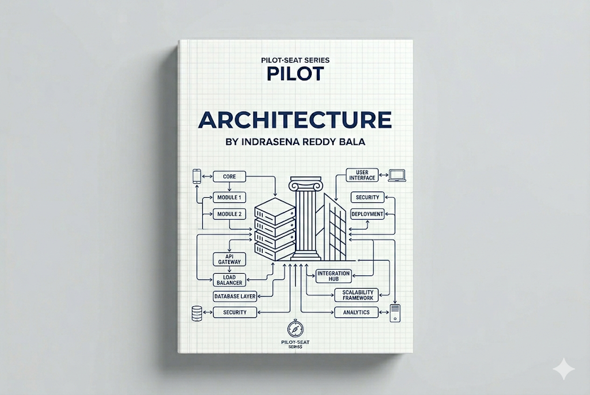

> **Mode:** Book
> **Pilot-Seat Standard**

---

# Introduction

Software Architecture is the high-level design and structure of a software system.

It defines:

* How components interact
* How data flows
* How systems communicate
* How applications scale
* How failures are handled
* How security is enforced

Think of architecture as the **blueprint of a building**.

Before constructing a building, architects create plans that define:

* Foundation
* Rooms
* Electrical systems
* Water systems
* Safety mechanisms

Similarly, software architects design systems before developers build them.

---

# Why It Exists

Without architecture:

```text
Developers
 ↓
Write Features
 ↓
Add More Features
 ↓
System Becomes Complex
 ↓
Difficult Maintenance
```

Problems:

* Technical debt
* Poor scalability
* Security issues
* Slow development
* Difficult troubleshooting

Architecture provides structure and direction.

---

# Problem It Solves

Consider a growing e-commerce platform.

Initially:

```text
Users
 ↓
Application
 ↓
Database
```

Works fine.

As growth occurs:

```text
100 Users
1000 Users
10000 Users
1000000 Users
```

New challenges appear:

* Performance bottlenecks
* Database overload
* Deployment complexity
* Reliability issues

Architecture helps systems evolve safely.

---

# What is Software Architecture?

Software Architecture is the process of organizing software components and defining their relationships.

Architecture answers:

```text
What should be built?

How should it be built?

How will it scale?

How will it be maintained?

How will it recover from failures?
```

---

# Architecture vs Design

| Architecture        | Design                   |
| ------------------- | ------------------------ |
| High-Level          | Low-Level                |
| System Structure    | Component Implementation |
| Strategic Decisions | Technical Decisions      |
| Long-Term Focus     | Feature Focus            |

Example:

Architecture:

```text
Frontend
Backend
Database
Cache
```

Design:

```text
Login API
User Service
Database Query
```

---

# Core Goals of Architecture

A good architecture should provide:

```text
Scalability
Reliability
Maintainability
Security
Performance
Availability
Flexibility
```

---

# Core Concepts

```text
Architecture
│
├── Components
├── Layers
├── Services
├── Interfaces
├── Data Flow
├── Communication
├── Security
└── Scalability
```

---

# Components

Components are independent parts of a system.

Example:

```text
E-Commerce Application
│
├── User Service
├── Product Service
├── Order Service
├── Payment Service
└── Notification Service
```

---

# Layers

Layering separates responsibilities.

Common architecture:

```text
Presentation Layer
 ↓
Business Layer
 ↓
Data Layer
```

Benefits:

* Maintainability
* Reusability
* Testability

---

# Architecture Principles

---

# Separation of Concerns

Each component should have a single responsibility.

Bad:

```text
One Service
Handles Everything
```

Good:

```text
Authentication Service

Order Service

Payment Service
```

Benefits:

* Cleaner code
* Easier maintenance

---

# Loose Coupling

Components should depend minimally on each other.

Bad:

```text
Service A
 ↓
Directly Controls
 ↓
Service B
```

Good:

```text
Service A
 ↓
API
 ↓
Service B
```

Benefits:

* Flexibility
* Easier updates

---

# High Cohesion

Related functionality should stay together.

Example:

```text
User Service
 ├── Login
 ├── Registration
 └── Profile
```

---

# Software Architecture Styles

Different systems require different architectures.

---

# Monolithic Architecture

All functionality exists within one application.

Architecture:

```text
Frontend
 ↓
Monolithic Application
 ↓
Database
```

---

## Characteristics

```text
Single Codebase
Single Deployment
Shared Database
```

---

## Advantages

* Simple development
* Easier deployment initially
* Faster MVP creation

---

## Disadvantages

* Difficult scaling
* Large codebase
* Tight coupling

---

## Best Use Cases

```text
Startups
MVPs
Small Applications
```

---

# Layered Architecture

One of the most common architectures.

Architecture:

```text
Presentation Layer
 ↓
Business Layer
 ↓
Data Access Layer
 ↓
Database
```

---

## Responsibilities

### Presentation Layer

Handles:

```text
User Interface
Requests
Responses
```

### Business Layer

Handles:

```text
Business Rules
Validation
Processing
```

### Data Layer

Handles:

```text
Database Access
Queries
Storage
```

---

## Advantages

* Organized structure
* Easier maintenance

---

# Client-Server Architecture

The foundation of web applications.

Architecture:

```text
Client
 ↓
Server
 ↓
Database
```

Examples:

* Websites
* Mobile Apps
* APIs

---

# Service-Oriented Architecture (SOA)

Applications are divided into services.

Architecture:

```text
Service A
Service B
Service C
 ↓
Shared Communication Layer
```

Benefits:

* Reusability
* Enterprise integration

---

# Microservices Architecture

Applications are split into small independent services.

Architecture:

```text
API Gateway
 ↓
├── User Service
├── Product Service
├── Order Service
├── Payment Service
└── Notification Service
```

---

## Characteristics

```text
Independent Services
Independent Deployments
Dedicated Databases
```

---

## Advantages

* Scalability
* Flexibility
* Team Independence

---

## Disadvantages

* Complexity
* Distributed system challenges

---

## Best Use Cases

```text
Large Platforms
Enterprise Systems
Cloud-Native Applications
```

---

# Event-Driven Architecture

Components communicate through events.

Architecture:

```text
Producer
 ↓
Event
 ↓
Message Broker
 ↓
Consumers
```

Examples:

* Notifications
* Order Processing
* Analytics

---

## Common Technologies

* Apache Kafka
* RabbitMQ

---

# Serverless Architecture

Applications run without managing servers.

Architecture:

```text
User Request
 ↓
Function
 ↓
Database
```

Examples:

* AWS Lambda
* Azure Functions
* Google Cloud Functions

---

## Advantages

* Automatic scaling
* Reduced operations

---

## Challenges

* Cold starts
* Vendor lock-in

---

# Clean Architecture

Popular architecture introduced by Robert C. Martin.

Architecture:

```text
Entities
 ↓
Use Cases
 ↓
Interface Adapters
 ↓
Frameworks
```

Core idea:

```text
Business Logic
Should Not Depend On Frameworks
```

Benefits:

* Testability
* Maintainability

---

# Hexagonal Architecture

Also known as:

```text
Ports and Adapters Architecture
```

Architecture:

```text
Application Core
 ↓
Ports
 ↓
Adapters
```

Benefits:

* Flexibility
* Easier integration

---

# Cloud-Native Architecture

Designed specifically for cloud environments.

Architecture:

```text
Microservices
 ↓
Containers
 ↓
Kubernetes
 ↓
Cloud Platform
```

Characteristics:

```text
Auto Scaling
Resilience
Observability
```

---

# Enterprise Architecture

Large organizations use enterprise architecture.

Architecture:

```text
Users
 ↓
API Gateway
 ↓
Microservices
 ↓
Databases
 ↓
Analytics
 ↓
Monitoring
```

---

# Architecture Building Blocks

Modern architectures commonly include:

```text
Frontend
Backend
API Gateway
Load Balancer
Cache
Database
Message Queue
Authentication
Monitoring
Logging
```

---

# Typical Modern Architecture

```text
Users
 ↓
CDN
 ↓
Load Balancer
 ↓
Frontend
 ↓
API Gateway
 ↓
Microservices
 ↓
Cache
 ↓
Databases
 ↓
Monitoring
```

---

# Architecture Workflow

## Step 1

Gather requirements.

Questions:

```text
Who are the users?

What problem is solved?

How many users?
```

---

## Step 2

Identify components.

Example:

```text
Frontend
Backend
Database
Cache
```

---

## Step 3

Define communication.

Example:

```text
HTTP
REST
gRPC
Events
```

---

## Step 4

Address scalability.

Example:

```text
Load Balancing
Caching
Replication
```

---

## Step 5

Address security.

Example:

```text
Authentication
Authorization
Encryption
```

---

## Step 6

Design monitoring.

Example:

```text
Metrics
Logs
Tracing
```

---

# Architecture Evolution

## Phase 1

```text
Monolith
```

---

## Phase 2

```text
Layered Monolith
```

---

## Phase 3

```text
Modular Monolith
```

---

## Phase 4

```text
Microservices
```

---

## Phase 5

```text
Cloud-Native Distributed Systems
```

---

# Best Practices

## Design for Change

### Problem

Requirements evolve.

### Solution

Create flexible architecture.

### Benefits

Long-term maintainability.

### Rollback

Refactor components gradually.

---

## Keep Components Independent

### Problem

Tight coupling.

### Solution

Use APIs and contracts.

### Benefits

Easier scaling.

### Rollback

Introduce abstraction layers.

---

## Build for Observability

### Problem

Production issues become invisible.

### Solution

Implement monitoring and logging.

### Benefits

Faster troubleshooting.

### Rollback

Adjust monitoring strategy.

---

# Industry Standards

Modern production architectures commonly use:

```text
Microservices
Containers
Kubernetes
Cloud Platforms
API Gateways
Redis
Kafka
Observability Platforms
```

---

# Common Mistakes

## Mistake 1

Choosing microservices too early.

---

## Mistake 2

Ignoring scalability.

---

## Mistake 3

No monitoring strategy.

---

## Mistake 4

Overengineering.

---

## Mistake 5

Ignoring security architecture.

---

# Security Considerations

Important areas:

```text
Authentication
Authorization
Encryption
Network Security
Secrets Management
Audit Logging
```

---

# Performance Considerations

Focus on:

```text
Caching
Load Balancing
Database Optimization
Asynchronous Processing
Content Delivery Networks
```

---

# Related Technologies

```text
System Design
Cloud Computing
DevOps
Kubernetes
Docker
Databases
Networking
Security
Distributed Systems
```

---

# Suggested Projects

## Beginner

```text
Layered Task Manager
Blog Platform
Inventory System
```

---

## Intermediate

```text
E-Commerce Platform
Job Portal
Learning Management System
```

---

## Advanced

```text
Ride Sharing Platform
Video Streaming Platform
Social Media Platform
Cloud-Native SaaS
```

---

# Summary

## What We Learned

* What Software Architecture is
* Why architecture matters
* Architecture principles
* Monolithic architecture
* Layered architecture
* Microservices
* Event-driven systems
* Serverless architecture
* Cloud-native architecture

---

## Why It Matters

Architecture determines how software evolves, scales, and survives over time.

Poor architecture can make a project difficult to maintain.

Good architecture enables:

* Growth
* Reliability
* Scalability
* Team productivity

---

## Key Takeaways

* Architecture is the blueprint of a software system.
* Different architectures solve different problems.
* Monoliths are often best for early-stage systems.
* Microservices help large-scale systems scale.
* Event-driven systems improve decoupling.
* Cloud-native architectures support modern deployments.
* Security, monitoring, and scalability should be architectural concerns from the start.

---

# Keywords

```text
Software Architecture
Monolith
Microservices
SOA
Layered Architecture
Clean Architecture
Hexagonal Architecture
Cloud-Native
Scalability
Reliability
Availability
API Gateway
Load Balancer
Distributed Systems
Event-Driven Architecture
```

---

# Glossary

| Term          | Meaning                                      |
| ------------- | -------------------------------------------- |
| Architecture  | High-level structure of a software system    |
| Monolith      | Single deployable application                |
| Microservice  | Independent deployable service               |
| API Gateway   | Entry point for multiple services            |
| Coupling      | Dependency between components                |
| Cohesion      | Related functionality grouped together       |
| Event         | Notification of something that happened      |
| Cloud-Native  | Designed specifically for cloud environments |
| Observability | Ability to understand system behavior        |
| Scalability   | Ability to handle increased load             |

---

# Next Chapters

```text
09-Architecture/
│
├── 01-Architecture Fundamentals
├── 02-Layered Architecture
├── 03-Monolithic Architecture
├── 04-Modular Monolith
├── 05-Service-Oriented Architecture
├── 06-Microservices Architecture
├── 07-Event-Driven Architecture
├── 08-Clean Architecture
├── 09-Hexagonal Architecture
├── 10-Cloud-Native Architecture
├── 11-Enterprise Architecture
├── 12-Architecture Patterns
├── 13-Architecture Anti-Patterns
├── 14-Architecture Decision Records
└── 15-Real-World Case Studies
```

This chapter establishes the foundation for understanding how software systems are structured, how architectural decisions impact long-term success, and how modern applications evolve from simple systems into scalable, resilient, cloud-native platforms.
